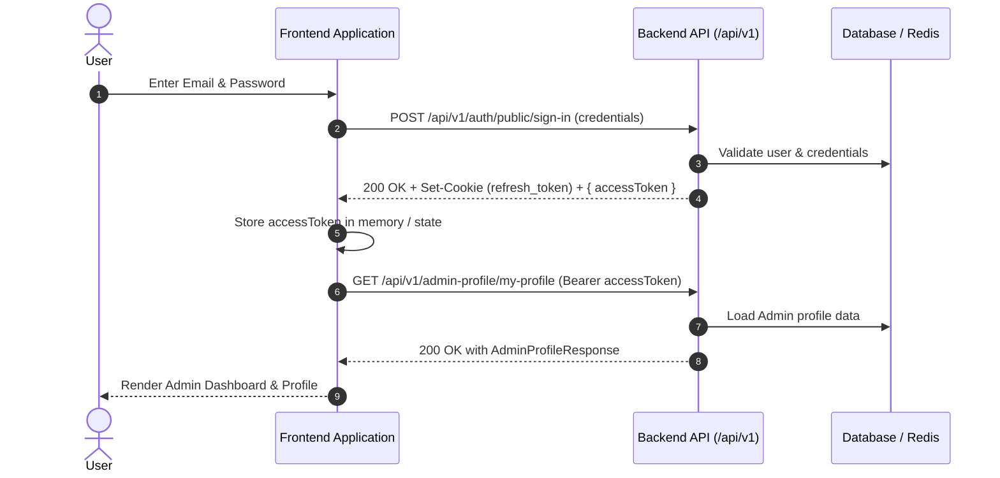
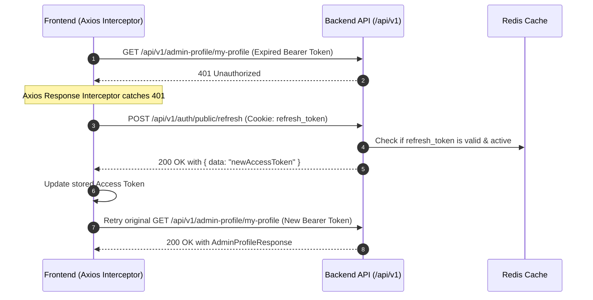

# Authentication & Admin Profile API Integration Guide

This document provides complete API integration specifications and code samples for Frontend (FE) developers integrating **Authentication** (Sign In, Token Refresh, Sign Out) and **Admin Profile** features.

---

## 1. Overview & Architecture

### Base URL
- **Local / Dev**: `http://localhost:8080`
- **Prefix**: All endpoints are prefixed under `/api/v1`

### Security & Token Mechanism
- **Access Token (JWT)**:
  - Short-lived JSON Web Token returned in the JSON response body (`data.accessToken`).
  - Must be passed in the `Authorization` header for protected endpoints:
    ```http
    Authorization: Bearer <accessToken>
    ```
- **Refresh Token (HttpOnly Cookie)**:
  - Stored securely in an `HttpOnly`, `SameSite` cookie named `refresh_token` (valid for 7 days).
  - Managed automatically by the browser when `withCredentials: true` (Axios) or `credentials: "include"` (Fetch API) is enabled.
- **Unified Response Wrapper**:
  All API responses follow the standard `ApiResponse<T>` structure:
  ```json
  {
    "status": "200",
    "message": "success",
    "data": { ... }
  }
  ```

---

## 2. Authentication Flowcharts

### 2.1 Sign-In & Profile Fetching Flow


---

### 2.2 Token Expiration & Silent Refresh Flow


---

## 3. API Endpoints Specification

### 3.1 Sign In
Authenticates user credentials and issues an Access Token in the response body along with an HttpOnly Refresh Token in the cookies.

- **URL**: `/api/v1/auth/public/sign-in`
- **Method**: `POST`
- **Auth Required**: `No` (Public endpoint)
- **Content-Type**: `application/json`

#### Request Body
| Field | Type | Required | Constraints | Description |
| :--- | :--- | :--- | :--- | :--- |
| `email` | string | Yes | Valid email format | User's registered email |
| `password` | string | Yes | Not blank | User's account password |

**Example Request:**
```json
{
  "email": "admin@example.com",
  "password": "SecretPassword123!"
}
```

#### Success Response (`200 OK`)
- **Headers**: `Set-Cookie: refresh_token=<refreshToken>; Path=/; HttpOnly; SameSite=Lax`
```json
{
  "status": "200",
  "message": "success",
  "data": {
    "accessToken": "eyJhbGciOiJIUzI1NiJ9..."
  }
}
```

#### Error Responses
- **`400 Bad Request`**: Validation error (invalid email format / empty fields) or incorrect password.
  ```json
  {
    "status": "400",
    "message": "Email or password is incorrect",
    "data": null
  }
  ```

---

### 3.2 Refresh Token
Exchanges the current valid Refresh Token (sent in the HttpOnly cookie) for a fresh Access Token.

- **URL**: `/api/v1/auth/public/refresh`
- **Method**: `POST`
- **Auth Required**: `No` (Public endpoint - authenticated via `refresh_token` cookie)
- **Credentials**: `include` / `withCredentials: true`

#### Request Headers
```http
Cookie: refresh_token=<refreshToken>
```

#### Success Response (`200 OK`)
```json
{
  "status": "200",
  "message": "success",
  "data": "eyJhbGciOiJIUzI1NiJ9.newAccessTokenHere..."
}
```

#### Error Responses
- **`409 Conflict / 400 Bad Request`**: Refresh token is expired, revoked, or invalid.
  ```json
  {
    "status": "invalid_token",
    "message": "Invalid token",
    "data": null
  }
  ```
  *(Frontend Action: Clear local token and redirect to `/login`)*

---

### 3.3 Sign Out
Revokes the refresh token in Redis and clears the client's `refresh_token` cookie.

- **URL**: `/api/v1/auth/sign-out`
- **Method**: `POST`
- **Auth Required**: `Yes` (Requires valid `refresh_token` cookie)
- **Credentials**: `include` / `withCredentials: true`

#### Success Response (`200 OK`)
- **Headers**: `Set-Cookie: refresh_token=; Path=/; Max-Age=0; HttpOnly`
```json
{
  "status": "204",
  "message": "success",
  "data": null
}
```

---

### 3.4 Get Admin Profile
Retrieves profile details of the currently authenticated administrator.

- **URL**: `/api/v1/admin-profile/my-profile`
- **Method**: `GET`
- **Auth Required**: `Yes` (`Authorization: Bearer <accessToken>`)

#### Success Response (`200 OK`)
```json
{
  "status": "200",
  "message": "success",
  "data": {
    "userId": "3fa85f64-5717-4562-b3fc-2c963f66afa6",
    "email": "admin@example.com",
    "name": "System Administrator",
    "avatar": "https://cdn.example.com/avatars/admin.png"
  }
}
```

#### Error Responses
- **`401 Unauthorized`**: Missing or expired access token.
- **`404 Not Found`**: Profile does not exist for the authenticated user.
  ```json
  {
    "status": "admin_profile_not_found",
    "message": "Admin profile not found",
    "data": null
  }
  ```

---

### 3.5 Update Admin Profile
Updates the profile information (name, avatar) of the currently authenticated administrator.

- **URL**: `/api/v1/admin-profile/my-profile`
- **Method**: `PUT`
- **Auth Required**: `Yes` (`Authorization: Bearer <accessToken>`)
- **Content-Type**: `application/json`

#### Request Body
| Field | Type | Required | Constraints | Description |
| :--- | :--- | :--- | :--- | :--- |
| `name` | string | Yes | Not blank | Admin's display name |
| `avatar` | string | No | URL string | Admin's avatar image URL |

**Example Request:**
```json
{
  "name": "Alex Admin",
  "avatar": "https://cdn.example.com/avatars/alex.png"
}
```

#### Success Response (`200 OK`)
```json
{
  "status": "200",
  "message": "success",
  "data": {
    "userId": "3fa85f64-5717-4562-b3fc-2c963f66afa6",
    "email": "admin@example.com",
    "name": "Alex Admin",
    "avatar": "https://cdn.example.com/avatars/alex.png"
  }
}
```

---

## 4. Error Code Reference

| Status Code | Error Code (`status`) | Description / Root Cause | Recommended FE Handling |
| :--- | :--- | :--- | :--- |
| `400` | `400` / `ERR_BAD_REQUEST` | Validation error / Invalid email or password | Highlight invalid form fields |
| `401` | `unauthenticated` | Access token missing or invalid | Attempt token refresh or redirect to sign-in |
| `403` | `unauthorized` | User lacks required role/permission | Display "Access Denied" page/banner |
| `404` | `user_not_found` | User account does not exist in DB | Prompt user to sign up or check email |
| `404` | `admin_profile_not_found` | Admin profile record does not exist | Contact system administrator |
| `409` | `invalid_token` | Refresh token invalid or expired | Force user logout & clear local session |
| `500` | `internal_error` | Unexpected server error | Show generic error toast/notification |

---

## 5. Ready-to-Use Frontend Integration Code (Axios)

Below is an Axios client setup with automatic token injection and refresh interceptor.

```typescript
// src/api/axiosClient.ts
import axios, { AxiosError, InternalAxiosRequestConfig } from 'axios';

let accessToken: string | null = null;

export const setAccessToken = (token: string | null) => {
  accessToken = token;
};

export const getAccessToken = () => accessToken;

export const apiClient = axios.create({
  baseURL: 'http://localhost:8080/api/v1',
  headers: {
    'Content-Type': 'application/json',
  },
  withCredentials: true, // IMPORTANT: Allows browser to send and receive HttpOnly cookies
});

// Request Interceptor: Attach Access Token
apiClient.interceptors.request.use((config: InternalAxiosRequestConfig) => {
  if (accessToken && config.headers) {
    config.headers.Authorization = `Bearer ${accessToken}`;
  }
  return config;
});

// Response Interceptor: Handle Token Refresh on 401
let isRefreshing = false;
let failedQueue: Array<{
  resolve: (value?: unknown) => void;
  reject: (reason?: unknown) => void;
}> = [];

const processQueue = (error: Error | null, token: string | null = null) => {
  failedQueue.forEach((promise) => {
    if (error) {
      promise.reject(error);
    } else {
      promise.resolve(token);
    }
  });
  failedQueue = [];
};

apiClient.interceptors.response.use(
  (response) => response,
  async (error: AxiosError) => {
    const originalRequest = error.config as InternalAxiosRequestConfig & { _retry?: boolean };

    // Check if error is 401 and request hasn't been retried yet
    if (error.response?.status === 401 && !originalRequest._retry) {
      // Avoid refreshing on sign-in or refresh endpoint itself
      if (originalRequest.url?.includes('/auth/public/sign-in') || originalRequest.url?.includes('/auth/public/refresh')) {
        return Promise.reject(error);
      }

      if (isRefreshing) {
        return new Promise((resolve, reject) => {
          failedQueue.push({ resolve, reject });
        })
          .then((token) => {
            if (originalRequest.headers) {
              originalRequest.headers.Authorization = `Bearer ${token}`;
            }
            return apiClient(originalRequest);
          })
          .catch((err) => Promise.reject(err));
      }

      originalRequest._retry = true;
      isRefreshing = true;

      try {
        // Call refresh token endpoint (cookie sent automatically due to withCredentials: true)
        const refreshResponse = await apiClient.post<{ status: string; data: string }>(
          '/auth/public/refresh'
        );
        const newAccessToken = refreshResponse.data.data;
        setAccessToken(newAccessToken);

        processQueue(null, newAccessToken);

        if (originalRequest.headers) {
          originalRequest.headers.Authorization = `Bearer ${newAccessToken}`;
        }
        return apiClient(originalRequest);
      } catch (refreshError) {
        processQueue(refreshError as Error, null);
        setAccessToken(null);
        // Redirect user to login page if refresh fails
        window.location.href = '/login';
        return Promise.reject(refreshError);
      } finally {
        isRefreshing = false;
      }
    }

    return Promise.reject(error);
  }
);
```

### Example API Functions
```typescript
// src/api/authService.ts
import { apiClient, setAccessToken } from './axiosClient';

export interface SignInPayload {
  email: string;
  password: string;
}

export interface AdminProfile {
  userId: string;
  email: string;
  name: string;
  avatar: string | null;
}

export interface UpdateProfilePayload {
  name: string;
  avatar?: string;
}

// Sign In
export const signIn = async (payload: SignInPayload) => {
  const response = await apiClient.post<{ data: { accessToken: string } }>(
    '/auth/public/sign-in',
    payload
  );
  const token = response.data.data.accessToken;
  setAccessToken(token);
  return token;
};

// Sign Out
export const signOut = async () => {
  await apiClient.post('/auth/sign-out');
  setAccessToken(null);
};

// Get Admin Profile
export const getAdminProfile = async (): Promise<AdminProfile> => {
  const response = await apiClient.get<{ data: AdminProfile }>(
    '/admin-profile/my-profile'
  );
  return response.data.data;
};

// Update Admin Profile
export const updateAdminProfile = async (
  payload: UpdateProfilePayload
): Promise<AdminProfile> => {
  const response = await apiClient.put<{ data: AdminProfile }>(
    '/admin-profile/my-profile',
    payload
  );
  return response.data.data;
};
```
