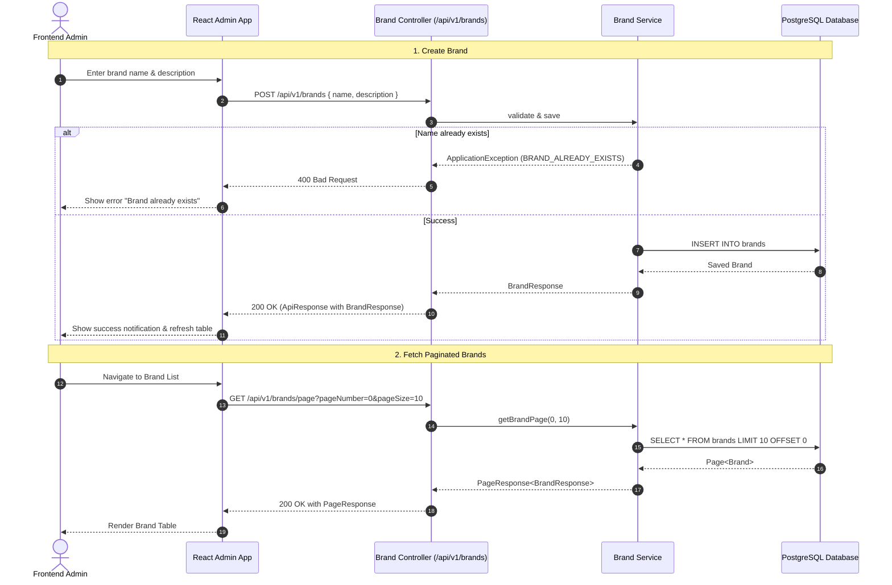
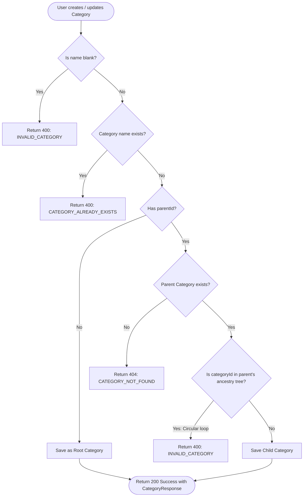

# Brand & Category API Integration Guide

This document provides complete API specifications, request/response structures, error handling details, Mermaid flowcharts, and production-ready TypeScript / Axios / React Query integration examples for Frontend developers integrating the **Brand** and **Category** modules.

---

## 1. Overview & Architecture

### Base URL & Paths
- **Base URL**: `http://localhost:8080` (or your configured environment gateway)
- **Brand API Base**: `/api/v1/brands`
- **Category API Base**: `/api/v1/categories`

### Unified Response Format
All endpoints return responses wrapped in the standard `ApiResponse<T>` envelope:

```json
{
  "status": "200",
  "message": "success",
  "data": { ... }
}
```

- **Success with Content (200)**: `"status": "200"`, `"message": "success"`, `data` contains the requested payload (Used for get, create, and update operations).
- **Success without Content (204)**: `"status": "204"`, `"message": "success"`, `data: null` (Used for delete operations).
- **Error Responses (4xx/5xx)**: `"status": "400" | "404" | ...`, `"message": "<error_message>"`, `data: null`.

### Pagination Format
Paginated endpoints return `PageResponse<T>` inside the `data` field:
- **Zero-based indexing**: `pageNumber` starts at `0`.
- **Default pagination**: `pageNumber = 0`, `pageSize = 10`.

---

## 2. Architecture & Workflows

### 2.1 Brand Management Workflow



### 2.2 Category Hierarchy & Validation Workflow



---

## 3. TypeScript Interfaces & Data Models

Place these definitions in your frontend shared types (e.g., `src/shared/types/catalog.ts`):

```typescript
// ==========================================
// Generic API Wrapper Types
// ==========================================
export interface ApiResponse<T> {
  status: string;
  message: string;
  data: T;
}

export interface PageResponse<T> {
  pageNumber: number;
  pageSize: number;
  totalPages: number;
  totalElements: number;
  content: T[];
}

export interface PaginationParams {
  pageNumber?: number;
  pageSize?: number;
}

// ==========================================
// Brand Data Types
// ==========================================
export interface BrandResponse {
  id: number;
  name: string;
  description: string | null;
  createdAt: string | null; // ISO 8601 string e.g. "2026-08-31T22:30:00+07:00"
  updatedAt: string | null; // ISO 8601 string
}

export interface BrandCreateRequest {
  name: string;
  description?: string | null;
}

export interface BrandUpdateRequest {
  name: string;
  description?: string | null;
}

// ==========================================
// Category Data Types
// ==========================================
export interface CategoryResponse {
  id: number;
  name: string;
  children: CategoryResponse[];
  createdAt: string | null; // ISO 8601 string
  updatedAt: string | null; // ISO 8601 string
}

export interface CategoryCreateRequest {
  name: string;
  parentId?: number | null;
}

export interface CategoryUpdateRequest {
  name: string;
  parentId?: number | null;
}
```

---

## 4. Brand API Endpoints Specification

### 4.1 Create Brand
Creates a new brand entity.

- **URL**: `/api/v1/brands`
- **Method**: `POST`
- **Content-Type**: `application/json`

#### Request Body
| Field | Type | Required | Validation | Description |
| :--- | :--- | :--- | :--- | :--- |
| `name` | `string` | **Yes** | `@NotBlank`, Unique | Name of the brand |
| `description` | `string` | No | Optional text | Description / overview of the brand |

```json
{
  "name": "Nike",
  "description": "Sportswear and athletic equipment"
}
```

#### Success Response (`200 OK`)
```json
{
  "status": "200",
  "message": "success",
  "data": {
    "id": 1,
    "name": "Nike",
    "description": "Sportswear and athletic equipment",
    "createdAt": "2026-08-31T20:15:30+07:00",
    "updatedAt": "2026-08-31T20:15:30+07:00"
  }
}
```

---

### 4.2 Update Brand
Updates an existing brand by ID.

- **URL**: `/api/v1/brands/{brandId}`
- **Method**: `PUT`
- **Content-Type**: `application/json`

#### Path Variables
| Parameter | Type | Required | Description |
| :--- | :--- | :--- | :--- |
| `brandId` | `number` (Integer) | **Yes** | Brand unique identifier |

#### Request Body
```json
{
  "name": "Nike Corporation",
  "description": "Updated brand overview"
}
```

#### Success Response (`200 OK`)
```json
{
  "status": "200",
  "message": "success",
  "data": {
    "id": 1,
    "name": "Nike Corporation",
    "description": "Updated brand overview",
    "createdAt": "2026-08-31T20:15:30+07:00",
    "updatedAt": "2026-08-31T20:25:00+07:00"
  }
}
```

---

### 4.3 Get Brand by ID
Fetches a single brand's details by ID.

- **URL**: `/api/v1/brands/{brandId}`
- **Method**: `GET`
- **Content-Type**: `application/json`

#### Success Response (`200 OK`)
```json
{
  "status": "200",
  "message": "success",
  "data": {
    "id": 1,
    "name": "Nike",
    "description": "Sportswear and athletic equipment",
    "createdAt": "2026-08-31T20:15:30+07:00",
    "updatedAt": "2026-08-31T20:15:30+07:00"
  }
}
```

#### Error Response (`404 Not Found`)
```json
{
  "status": "404",
  "message": "Brand not found",
  "data": null
}
```

---

### 4.4 Get Paginated Brands
Retrieves a paginated list of brands.

- **URL**: `/api/v1/brands/page`
- **Method**: `GET`
- **Query Parameters**:
  - `pageNumber` *(optional, integer, default: `0`)*: 0-indexed page number.
  - `pageSize` *(optional, integer, default: `10`)*: Number of items per page.

#### Success Response (`200 OK`)
```json
{
  "status": "200",
  "message": "success",
  "data": {
    "pageNumber": 0,
    "pageSize": 10,
    "totalPages": 1,
    "totalElements": 2,
    "content": [
      {
        "id": 1,
        "name": "Nike",
        "description": "Sportswear and athletic equipment",
        "createdAt": "2026-08-31T20:15:30+07:00",
        "updatedAt": "2026-08-31T20:15:30+07:00"
      },
      {
        "id": 2,
        "name": "Adidas",
        "description": "Impossible is nothing",
        "createdAt": "2026-08-31T20:16:00+07:00",
        "updatedAt": "2026-08-31T20:16:00+07:00"
      }
    ]
  }
}
```

---

### 4.5 Delete Brand
Deletes a brand by ID.

- **URL**: `/api/v1/brands/{brandId}`
- **Method**: `DELETE`

#### Success Response (`200 OK` with 204 status code)
```json
{
  "status": "204",
  "message": "success",
  "data": null
}
```

---

## 5. Category API Endpoints Specification

### 5.1 Create Category
Creates a root or child category.

- **URL**: `/api/v1/categories`
- **Method**: `POST`
- **Content-Type**: `application/json`

#### Request Body
| Field | Type | Required | Validation | Description |
| :--- | :--- | :--- | :--- | :--- |
| `name` | `string` | **Yes** | `@NotBlank`, Unique | Category name |
| `parentId` | `number` (Integer) | No | Optional valid Category ID | Parent category ID (null if root category) |

#### Example (Root Category)
```json
{
  "name": "Fashion",
  "parentId": null
}
```

#### Example (Child Category)
```json
{
  "name": "Men's Shoes",
  "parentId": 1
}
```

#### Success Response (`200 OK`)
```json
{
  "status": "200",
  "message": "success",
  "data": {
    "id": 1,
    "name": "Fashion",
    "children": [],
    "createdAt": "2026-08-31T20:10:00+07:00",
    "updatedAt": "2026-08-31T20:10:00+07:00"
  }
}
```

---

### 5.2 Update Category
Updates a category's name and/or parent category.

- **URL**: `/api/v1/categories/{categoryId}`
- **Method**: `PUT`
- **Content-Type**: `application/json`

> [!NOTE]
> The backend validates against circular hierarchies (i.e. you cannot set a category's parent to itself or any of its descendants).

#### Request Body
```json
{
  "name": "Men's Footwear",
  "parentId": 1
}
```

#### Success Response (`200 OK`)
```json
{
  "status": "200",
  "message": "success",
  "data": {
    "id": 2,
    "name": "Men's Footwear",
    "children": [],
    "createdAt": "2026-08-31T20:18:00+07:00",
    "updatedAt": "2026-08-31T20:25:00+07:00"
  }
}
```

---

### 5.3 Get Category by ID (With Hierarchy Tree)
Fetches a category with its nested `children` tree.

- **URL**: `/api/v1/categories/{categoryId}`
- **Method**: `GET`

#### Success Response (`200 OK`)
```json
{
  "status": "200",
  "message": "success",
  "data": {
    "id": 1,
    "name": "Fashion",
    "children": [
      {
        "id": 2,
        "name": "Men's Footwear",
        "children": [
          {
            "id": 3,
            "name": "Running Shoes",
            "children": [],
            "createdAt": "2026-08-31T20:20:00+07:00",
            "updatedAt": "2026-08-31T20:20:00+07:00"
          }
        ],
        "createdAt": "2026-08-31T20:18:00+07:00",
        "updatedAt": "2026-08-31T20:19:00+07:00"
      }
    ],
    "createdAt": "2026-08-31T20:10:00+07:00",
    "updatedAt": "2026-08-31T20:10:00+07:00"
  }
}
```

---

### 5.4 Get Paginated Categories
Retrieves a paginated list of top/all categories.

- **URL**: `/api/v1/categories/page`
- **Method**: `GET`
- **Query Parameters**:
  - `pageNumber` *(optional, integer, default: `0`)*
  - `pageSize` *(optional, integer, default: `10`)*

#### Success Response (`200 OK`)
```json
{
  "status": "200",
  "message": "success",
  "data": {
    "pageNumber": 0,
    "pageSize": 10,
    "totalPages": 1,
    "totalElements": 2,
    "content": [
      {
        "id": 1,
        "name": "Fashion",
        "children": [ ... ],
        "createdAt": "2026-08-31T20:10:00+07:00",
        "updatedAt": "2026-08-31T20:10:00+07:00"
      }
    ]
  }
}
```

---

### 5.5 Delete Category
Deletes a category by ID.

- **URL**: `/api/v1/categories/{categoryId}`
- **Method**: `DELETE`

#### Success Response (`200 OK` with 204 status code)
```json
{
  "status": "204",
  "message": "success",
  "data": null
}
```

---

## 6. Frontend Integration Examples

### 6.1 Axios Services Implementation

#### `brandService.ts`
```typescript
import axios from 'axios';
import {
  ApiResponse,
  BrandCreateRequest,
  BrandResponse,
  BrandUpdateRequest,
  PageResponse,
  PaginationParams,
} from '@/shared/types/catalog';

const apiClient = axios.create({
  baseURL: 'http://localhost:8080/api/v1',
  withCredentials: true,
});

export const brandService = {
  getBrandsPage: async (params?: PaginationParams): Promise<PageResponse<BrandResponse>> => {
    const response = await apiClient.get<ApiResponse<PageResponse<BrandResponse>>>('/brands/page', {
      params: {
        pageNumber: params?.pageNumber ?? 0,
        pageSize: params?.pageSize ?? 10,
      },
    });
    return response.data.data;
  },

  getBrandById: async (brandId: number): Promise<BrandResponse> => {
    const response = await apiClient.get<ApiResponse<BrandResponse>>(`/brands/${brandId}`);
    return response.data.data;
  },

  createBrand: async (payload: BrandCreateRequest): Promise<BrandResponse> => {
    const response = await apiClient.post<ApiResponse<BrandResponse>>('/brands', payload);
    return response.data.data;
  },

  updateBrand: async (brandId: number, payload: BrandUpdateRequest): Promise<BrandResponse> => {
    const response = await apiClient.put<ApiResponse<BrandResponse>>(`/brands/${brandId}`, payload);
    return response.data.data;
  },

  deleteBrand: async (brandId: number): Promise<void> => {
    await apiClient.delete<ApiResponse<void>>(`/brands/${brandId}`);
  },
};
```

#### `categoryService.ts`
```typescript
import axios from 'axios';
import {
  ApiResponse,
  CategoryCreateRequest,
  CategoryResponse,
  CategoryUpdateRequest,
  PageResponse,
  PaginationParams,
} from '@/shared/types/catalog';

const apiClient = axios.create({
  baseURL: 'http://localhost:8080/api/v1',
  withCredentials: true,
});

export const categoryService = {
  getCategoriesPage: async (params?: PaginationParams): Promise<PageResponse<CategoryResponse>> => {
    const response = await apiClient.get<ApiResponse<PageResponse<CategoryResponse>>>('/categories/page', {
      params: {
        pageNumber: params?.pageNumber ?? 0,
        pageSize: params?.pageSize ?? 10,
      },
    });
    return response.data.data;
  },

  getCategoryById: async (categoryId: number): Promise<CategoryResponse> => {
    const response = await apiClient.get<ApiResponse<CategoryResponse>>(`/categories/${categoryId}`);
    return response.data.data;
  },

  createCategory: async (payload: CategoryCreateRequest): Promise<CategoryResponse> => {
    const response = await apiClient.post<ApiResponse<CategoryResponse>>('/categories', payload);
    return response.data.data;
  },

  updateCategory: async (categoryId: number, payload: CategoryUpdateRequest): Promise<CategoryResponse> => {
    const response = await apiClient.put<ApiResponse<CategoryResponse>>(`/categories/${categoryId}`, payload);
    return response.data.data;
  },

  deleteCategory: async (categoryId: number): Promise<void> => {
    await apiClient.delete<ApiResponse<void>>(`/categories/${categoryId}`);
  },
};
```

---

### 6.2 TanStack Query (React Query) Hooks

#### `useBrandQueries.ts`
```typescript
import { useQuery, useMutation, useQueryClient } from '@tanstack/react-query';
import { brandService } from '@/shared/services/api/brandService';
import { BrandCreateRequest, BrandUpdateRequest, PaginationParams } from '@/shared/types/catalog';

export const BRAND_QUERY_KEY = 'brands';

export const useBrandPageQuery = (params: PaginationParams) => {
  return useQuery({
    queryKey: [BRAND_QUERY_KEY, 'page', params],
    queryFn: () => brandService.getBrandsPage(params),
  });
};

export const useBrandDetailQuery = (brandId: number, enabled = true) => {
  return useQuery({
    queryKey: [BRAND_QUERY_KEY, 'detail', brandId],
    queryFn: () => brandService.getBrandById(brandId),
    enabled: !!brandId && enabled,
  });
};

export const useCreateBrandMutation = () => {
  const queryClient = useQueryClient();
  return useMutation({
    mutationFn: (payload: BrandCreateRequest) => brandService.createBrand(payload),
    onSuccess: () => {
      queryClient.invalidateQueries({ queryKey: [BRAND_QUERY_KEY] });
    },
  });
};

export const useUpdateBrandMutation = () => {
  const queryClient = useQueryClient();
  return useMutation({
    mutationFn: ({ id, payload }: { id: number; payload: BrandUpdateRequest }) =>
      brandService.updateBrand(id, payload),
    onSuccess: () => {
      queryClient.invalidateQueries({ queryKey: [BRAND_QUERY_KEY] });
    },
  });
};

export const useDeleteBrandMutation = () => {
  const queryClient = useQueryClient();
  return useMutation({
    mutationFn: (brandId: number) => brandService.deleteBrand(brandId),
    onSuccess: () => {
      queryClient.invalidateQueries({ queryKey: [BRAND_QUERY_KEY] });
    },
  });
};
```

#### `useCategoryQueries.ts`
```typescript
import { useQuery, useMutation, useQueryClient } from '@tanstack/react-query';
import { categoryService } from '@/shared/services/api/categoryService';
import { CategoryCreateRequest, CategoryUpdateRequest, PaginationParams } from '@/shared/types/catalog';

export const CATEGORY_QUERY_KEY = 'categories';

export const useCategoryPageQuery = (params: PaginationParams) => {
  return useQuery({
    queryKey: [CATEGORY_QUERY_KEY, 'page', params],
    queryFn: () => categoryService.getCategoriesPage(params),
  });
};

export const useCategoryDetailQuery = (categoryId: number, enabled = true) => {
  return useQuery({
    queryKey: [CATEGORY_QUERY_KEY, 'detail', categoryId],
    queryFn: () => categoryService.getCategoryById(categoryId),
    enabled: !!categoryId && enabled,
  });
};

export const useCreateCategoryMutation = () => {
  const queryClient = useQueryClient();
  return useMutation({
    mutationFn: (payload: CategoryCreateRequest) => categoryService.createCategory(payload),
    onSuccess: () => {
      queryClient.invalidateQueries({ queryKey: [CATEGORY_QUERY_KEY] });
    },
  });
};

export const useUpdateCategoryMutation = () => {
  const queryClient = useQueryClient();
  return useMutation({
    mutationFn: ({ id, payload }: { id: number; payload: CategoryUpdateRequest }) =>
      categoryService.updateCategory(id, payload),
    onSuccess: () => {
      queryClient.invalidateQueries({ queryKey: [CATEGORY_QUERY_KEY] });
    },
  });
};

export const useDeleteCategoryMutation = () => {
  const queryClient = useQueryClient();
  return useMutation({
    mutationFn: (categoryId: number) => categoryService.deleteCategory(categoryId),
    onSuccess: () => {
      queryClient.invalidateQueries({ queryKey: [CATEGORY_QUERY_KEY] });
    },
  });
};
```

---

## 7. Error Codes Reference

| Error Code | HTTP Status | Backend Reason | Recommended Frontend UI Action |
| :--- | :--- | :--- | :--- |
| `INVALID_BRAND` | `400 Bad Request` | Brand name is empty/blank or payload is invalid. | Show input validation error on the name field. |
| `BRAND_ALREADY_EXISTS` | `400 Bad Request` | A brand with the specified name already exists. | Display warning: *"A brand with this name already exists. Please choose a different name."* |
| `BRAND_NOT_FOUND` | `404 Not Found` | No brand exists with the provided `brandId`. | Show 404 toast or redirect to the brand list page. |
| `INVALID_CATEGORY` | `400 Bad Request` | Category name is empty or circular parent hierarchy detected. | Show validation message or alert preventing selecting a descendant as parent. |
| `CATEGORY_ALREADY_EXISTS` | `400 Bad Request` | A category with the specified name already exists. | Display warning: *"Category name already exists."* |
| `CATEGORY_NOT_FOUND` | `404 Not Found` | The specified category or parent ID does not exist. | Show not found error notification. |
