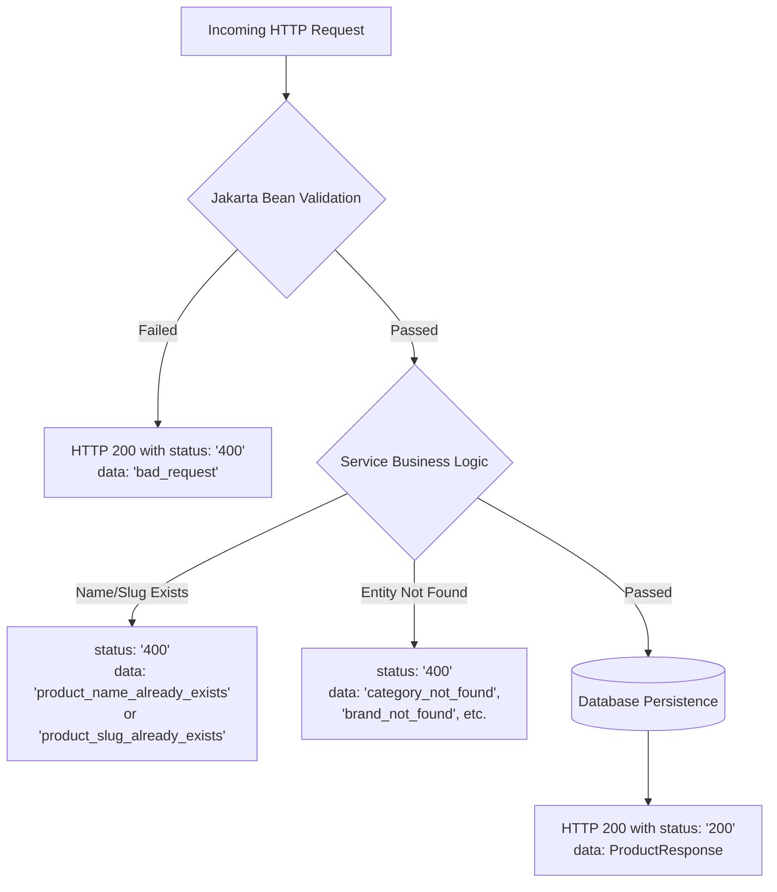

# Product API Integration Guide

This guide provides technical specifications for integrating with the Product REST API. It covers endpoint paths, request contracts, response schemas, and validation constraints.

---

## 1. Endpoints Overview

| Method | Endpoint | Description | Request Body | Response | Authorization |
| :--- | :--- | :--- | :--- | :--- | :---: |
| `POST` | `/api/v1/products` | Create a new product with options, attributes, and variants | `ProductCreateRequest` | `ApiResponse<ProductResponse>` | Required |
| `PUT` | `/api/v1/products/{productId}` | Update an existing product (delta update) | `ProductUpdateRequest` | `ApiResponse<ProductResponse>` | Required |
| `GET` | `/api/v1/products/{productId}` | Retrieve full product details by ID | *None* | `ApiResponse<ProductResponse>` | Public |
| `GET` | `/api/v1/products/page` | Query paginated list of product thumbnails | *Query Parameters* | `ApiResponse<PageResponse<ProductThumbnailResponse>>` | Public |
| `DELETE` | `/api/v1/products/{productId}` | Delete product and its associated relations | *None* | `ApiResponse<Void>` | Required |

### Common Headers
- **Content-Type**: `application/json`
- **Accept**: `application/json`
- **Authorization**: `Bearer <jwt_token>` (for `POST`, `PUT`, `DELETE`)

### Query Parameters for `GET /api/v1/products/page`
| Parameter | Type | Default | Constraints | Description |
| :--- | :--- | :--- | :--- | :--- |
| `pageNumber` | `integer` | `0` | $\ge 0$ | Zero-based page index. |
| `pageSize` | `integer` | `10` | $> 0$ | Number of records per page. |
| `name` | `string` | *null* | Optional | Filter products by name (case-insensitive contains). |
| `categoryId` | `integer` | *null* | Optional | Filter products belonging to a specific category ID. |
| `brandId` | `integer` | *null* | Optional | Filter products belonging to a specific brand ID. |

---

## 2. Request Specifications & Validation Constraints

> [!NOTE]
> The application uses Jackson `SNAKE_CASE` naming strategy (`property-naming-strategy: SNAKE_CASE`). Request bodies accept standard JSON with snake_case property keys.

### 2.1 Product Create Request (`ProductCreateRequest`)

Endpoint: `POST /api/v1/products`

| Field | Type | Required | Constraints | Description |
| :--- | :--- | :---: | :--- | :--- |
| `name` | `string` | **Yes** | `@NotBlank`, Unique in DB | Unique product display name. |
| `slug` | `string` | **Yes** | `@NotBlank`, Unique in DB | Unique URL-friendly slug. |
| `description` | `string \| null` | No | None | Product description (supports HTML/markdown). |
| `meta_title` | `string \| null` | No | None | SEO meta title. |
| `meta_keyword` | `string \| null` | No | None | SEO keywords. |
| `meta_description` | `string \| null` | No | None | SEO meta description. |
| `category_id` | `integer \| null` | No | Must exist in `tbl_category` if provided | Foreign key ID of Category. |
| `brand_id` | `integer \| null` | No | Must exist in `tbl_brand` if provided | Foreign key ID of Brand. |
| `medias` | `Array<ProductMediaRequest> \| null` | No | `@Valid` | List of gallery media items. |
| `options` | `Array<ProductOptionCombinationCreateRequest> \| null` | No | `@Valid` | Product-level option combinations. |
| `attributes` | `Array<ProductAttributeValueCreateRequest> \| null` | No | `@Valid` | Product-level specification attributes. |
| `variants` | `Array<ProductVariantCreateRequest>` | **Yes** | `@Valid`, `@NotEmpty` | List of variants. Must contain at least 1 variant. |

---

### 2.2 Product Update Request (`ProductUpdateRequest`)

Endpoint: `PUT /api/v1/products/{productId}`

Path Variable: `productId` (`Long`, required, must exist in DB).

| Field | Type | Required | Constraints | Description |
| :--- | :--- | :---: | :--- | :--- |
| `name` | `string` | **Yes** | `@NotBlank`, Unique in DB excluding current | Updated product name. |
| `slug` | `string` | **Yes** | `@NotBlank`, Unique in DB excluding current | Updated URL slug. |
| `description` | `string \| null` | No | None | Updated description. |
| `meta_title` | `string \| null` | No | None | Updated SEO title. |
| `meta_keyword` | `string \| null` | No | None | Updated SEO keywords. |
| `meta_description` | `string \| null` | No | None | Updated SEO description. |
| `category_id` | `integer \| null` | No | Must exist in DB if provided | Category ID. Pass `null` to disassociate. |
| `brand_id` | `integer \| null` | No | Must exist in DB if provided | Brand ID. Pass `null` to disassociate. |
| `medias` | `Array<ProductMediaRequest> \| null` | No | `@Valid` | Updated media list. Omitted medias are deleted. |
| `options` | `Array<ProductOptionCombinationUpdateRequest> \| null` | No | `@Valid` | Updated options list. Omitted options are deleted. |
| `attributes` | `Array<ProductAttributeValueUpdateRequest> \| null` | No | `@Valid` | Updated product attributes. Omitted attributes are deleted. |
| `variants` | `Array<ProductVariantUpdateRequest>` | **Yes** | `@Valid`, `@NotEmpty` | Updated variants list. Omitted variants are deleted. |

---

### 2.3 Nested Request Objects

#### `ProductMediaRequest`
Used in `medias` list of both Create and Update requests.

| Field | Type | Required | Constraints | Description |
| :--- | :--- | :---: | :--- | :--- |
| `media_id` | `string` | **Yes** | `@NotBlank` | Media UUID identifier. |
| `position` | `integer \| null` | No | None | Display sort order (0-indexed). |

---

#### `ProductOptionCombinationCreateRequest`
Used in `options` list of `ProductCreateRequest`.

| Field | Type | Required | Constraints | Description |
| :--- | :--- | :---: | :--- | :--- |
| `product_option_id` | `integer (Long)` | **Yes** | `@NotNull`, Must exist in `tbl_product_option` | ID of the global Product Option (e.g. Color, Size). |
| `position` | `integer` | No | None | Display position order of the option. |
| `values` | `Array<ProductOptionValueCreateRequest>` | No | `@Valid` | Predefined values allowed for this product option. |

#### `ProductOptionCombinationUpdateRequest`
Used in `options` list of `ProductUpdateRequest`.

| Field | Type | Required | Constraints | Description |
| :--- | :--- | :---: | :--- | :--- |
| `product_option_id` | `integer (Long)` | **Yes** | `@NotNull`, Must exist in `tbl_product_option` | ID of the global Product Option. |
| `position` | `integer` | No | None | Display position order of the option. |
| `values` | `Array<ProductOptionValueUpdateRequest>` | No | `@Valid` | Updated option values. |

---

#### `ProductOptionValueCreateRequest`
Used in `values` list of `ProductOptionCombinationCreateRequest`.

| Field | Type | Required | Constraints | Description |
| :--- | :--- | :---: | :--- | :--- |
| `value` | `string` | **Yes** | `@NotBlank` | Value label (e.g. `"Red"`, `"XL"`). |
| `position` | `integer` | No | None | Display sort order within option. |

#### `ProductOptionValueUpdateRequest`
Used in `values` list of `ProductOptionCombinationUpdateRequest`.

| Field | Type | Required | Constraints | Description |
| :--- | :--- | :---: | :--- | :--- |
| `id` | `integer (Long) \| null` | No | Optional | Existing `ProductOptionValue` ID. Omit if adding a new value. |
| `value` | `string` | **Yes** | `@NotBlank` | Value label. |
| `position` | `integer` | No | None | Display sort order within option. |

---

#### `ProductAttributeValueCreateRequest` & `ProductAttributeValueUpdateRequest`
Used in `attributes` list for product-level specifications.

| Field | Type | Required | Constraints | Description |
| :--- | :--- | :---: | :--- | :--- |
| `product_attribute_id` | `integer (Long)` | **Yes** | `@NotNull`, Must exist in `tbl_product_attribute` | ID of the global Product Attribute. |
| `value` | `string` | **Yes** | `@NotBlank` | Attribute specification value. |

---

#### `ProductVariantCreateRequest`
Used in `variants` list of `ProductCreateRequest`.

| Field | Type | Required | Constraints | Description |
| :--- | :--- | :---: | :--- | :--- |
| `title` | `string \| null` | No | None (defaults to `"Default Title"` if null/blank) | Display title of the variant. |
| `sku` | `string` | **Yes** | `@NotBlank` | Stock Keeping Unit identifier. |
| `price` | `number (BigDecimal)` | **Yes** | `@NotNull`, `@PositiveOrZero` | Selling price ($\ge 0.00$). |
| `quantity` | `integer` | **Yes** | `@PositiveOrZero` | Inventory stock count ($\ge 0$). |
| `media_id` | `string \| null` | No | None | Optional Media UUID representing this variant. |
| `option_values` | `Array<ProductVariantOptionValueCreateRequest> \| null` | No | `@Valid` | Explicit list of option values bound to this variant. |
| `attribute_values` | `Array<ProductVariantAttributeValueCreateRequest> \| null` | No | `@Valid` | Variant-specific custom attributes. |

#### `ProductVariantUpdateRequest`
Used in `variants` list of `ProductUpdateRequest`.

| Field | Type | Required | Constraints | Description |
| :--- | :--- | :---: | :--- | :--- |
| `id` | `integer (Long) \| null` | No | Optional | Existing variant ID to update in-place. If omitted/null, a new variant is inserted. |
| `title` | `string \| null` | No | None (defaults to `"Default Title"` if null/blank) | Display title of the variant. |
| `sku` | `string` | **Yes** | `@NotBlank` | Stock Keeping Unit identifier. |
| `price` | `number (BigDecimal)` | **Yes** | `@NotNull`, `@PositiveOrZero` | Selling price ($\ge 0.00$). |
| `quantity` | `integer` | **Yes** | `@PositiveOrZero` | Inventory stock count ($\ge 0$). |
| `media_id` | `string \| null` | No | None | Optional Media UUID representing this variant. |
| `option_values` | `Array<ProductVariantOptionValueUpdateRequest> \| null` | No | `@Valid` | Explicit list of option values bound to this variant. |
| `attribute_values` | `Array<ProductVariantAttributeValueUpdateRequest> \| null` | No | `@Valid` | Variant-specific custom attributes. |

---

#### `ProductVariantOptionValueCreateRequest`
Used in `option_values` of `ProductVariantCreateRequest`.

| Field | Type | Required | Constraints | Description |
| :--- | :--- | :---: | :--- | :--- |
| `product_option_id` | `integer (Long)` | **Yes** | `@NotNull` | ID of the Product Option (e.g., Color). |
| `value` | `string` | **Yes** | `@NotBlank` | The option value string matching one defined in product options. |

#### `ProductVariantOptionValueUpdateRequest`
Used in `option_values` of `ProductVariantUpdateRequest`.

| Field | Type | Required | Constraints | Description |
| :--- | :--- | :---: | :--- | :--- |
| `product_option_value_id` | `integer (Long) \| null` | No | Optional | Direct ID of `ProductOptionValue` if already known. |
| `product_option_id` | `integer (Long) \| null` | No | Required if `product_option_value_id` is null | ID of the Product Option. |
| `value` | `string \| null` | No | Required if `product_option_value_id` is null | Option value string. |

---

#### `ProductVariantAttributeValueCreateRequest` & `ProductVariantAttributeValueUpdateRequest`
Used in `attribute_values` of variant requests.

| Field | Type | Required | Constraints | Description |
| :--- | :--- | :---: | :--- | :--- |
| `product_attribute_id` | `integer (Long)` | **Yes** | `@NotNull`, Must exist in `tbl_product_attribute` | ID of the global Product Attribute. |
| `value` | `string` | **Yes** | `@NotBlank` | Variant attribute value string. |

---

## 3. Response Specifications

### 3.1 Response Envelope (`ApiResponse<T>`)
Every API response is wrapped in a standard envelope:

| Field | Type | Description |
| :--- | :--- | :--- |
| `status` | `string` | HTTP status code string (e.g. `"200"`, `"400"`, `"404"`, `"500"`). |
| `message` | `string` | Status message (`"Success"`, `"Bad request"`, etc.). |
| `data` | `T` | Payload object on success, or error string / code on failure. |

---

### 3.2 Product Details Response (`ProductResponse`)

Returned by `POST /api/v1/products`, `PUT /api/v1/products/{productId}`, and `GET /api/v1/products/{productId}`.

| Field | Type | Nullable | Description |
| :--- | :--- | :---: | :--- |
| `id` | `integer (Long)` | No | Product primary key. |
| `name` | `string` | No | Product name. |
| `description` | `string` | Yes | Product description. |
| `slug` | `string` | No | URL slug. |
| `meta_title` | `string` | Yes | SEO title. |
| `meta_keyword` | `string` | Yes | SEO keywords. |
| `meta_description` | `string` | Yes | SEO description. |
| `brand` | `BrandResponse` | Yes | Associated Brand details. |
| `category` | `CategoryResponse` | Yes | Associated Category details (excluding child categories). |
| `medias` | `Array<ProductMediaResponse>` | No | Ordered list of product gallery media. |
| `attributes` | `Array<ProductAttributeValueResponse>` | No | Product-level attributes. |
| `options` | `Array<ProductOptionCombinationResponse>` | No | Product options and their configured values. |
| `variants` | `Array<ProductVariantResponse>` | No | Full list of product variants. |
| `created_at` | `string (ISO-8601)` | Yes | Entity creation timestamp (`YYYY-MM-DDTHH:mm:ssZ`). |
| `updated_at` | `string (ISO-8601)` | Yes | Entity last update timestamp (`YYYY-MM-DDTHH:mm:ssZ`). |

#### Nested Response Structures:

- **`BrandResponse`**:
  - `id`: `integer (Long)`
  - `name`: `string`
  - `description`: `string | null`
  - `created_at`: `string (ISO-8601)`
  - `updated_at`: `string (ISO-8601)`

- **`CategoryResponse`**:
  - `id`: `integer (Long)`
  - `name`: `string`
  - `created_at`: `string (ISO-8601)`
  - `updated_at`: `string (ISO-8601)`

- **`ProductMediaResponse`**:
  - `media_id`: `string`
  - `position`: `integer`
  - `url`: `string | null` (Resolved public URL of the media)
  - `variant_ids`: `Array<integer (Long)>` (IDs of variants associated with this media)

- **`ProductAttributeValueResponse`**:
  - `id`: `integer (Long)`
  - `product_attribute_id`: `integer (Long)`
  - `name`: `string` (Name of the attribute definition)
  - `value`: `string`

- **`ProductOptionCombinationResponse`**:
  - `product_option_id`: `integer (Long)`
  - `name`: `string` (Name of the option, e.g. "Color")
  - `position`: `integer`
  - `values`: `Array<ProductOptionValueResponse>`:
    - `id`: `integer (Long)` (Primary key of `tbl_product_option_value`)
    - `value`: `string`
    - `position`: `integer`

- **`ProductVariantResponse`**:
  - `id`: `integer (Long)`
  - `title`: `string`
  - `product_option_value_ids`: `Array<integer (Long)>` (IDs of linked `ProductOptionValue` records)
  - `attribute_values`: `Array<ProductVariantAttributeValueResponse>`:
    - `product_attribute_id`: `integer (Long)`
    - `name`: `string`
    - `value`: `string`
  - `sku`: `string`
  - `price`: `number (BigDecimal)`
  - `quantity`: `integer`
  - `media_id`: `string | null`
  - `media_url`: `string | null` (Resolved public URL of the variant image)

---

### 3.3 Paginated Thumbnail Response (`PageResponse<ProductThumbnailResponse>`)

Returned by `GET /api/v1/products/page`.

| Field | Type | Description |
| :--- | :--- | :--- |
| `page_number` | `integer` | Current 0-based page index. |
| `page_size` | `integer` | Number of items per page. |
| `total_pages` | `integer` | Total available pages. |
| `total_elements` | `integer (Long)` | Total available items across all pages. |
| `content` | `Array<ProductThumbnailResponse>` | Array of thumbnail items for the current page. |

#### `ProductThumbnailResponse`:
| Field | Type | Nullable | Description |
| :--- | :--- | :---: | :--- |
| `id` | `integer (Long)` | No | Product primary key. |
| `name` | `string` | No | Product name. |
| `slug` | `string` | No | Product slug. |
| `thumbnail_url` | `string` | Yes | URL of first gallery media item or default variant image. |
| `price` | `number (BigDecimal)` | Yes | Minimum variant price or base price. |

---

## 4. Validation Rules & Error Handling

### 4.1 Validation Layers

### 4.2 Error Code Mapping

When a constraint or lookup fails, the API responds with `status: "400"` and a specific error code in `data`:

| Error Code | HTTP Status in Body | Cause / Constraint Violated |
| :--- | :---: | :--- |
| `bad_request` | `400` | Jakarta validation failed (`@NotBlank`, `@NotNull`, `@NotEmpty`, `@PositiveOrZero`). |
| `product_name_already_exists` | `400` | Product `name` is already in use by another product in the database. |
| `product_slug_already_exists` | `400` | Product `slug` is already in use by another product in the database. |
| `product_not_found` | `400` | Specified `productId` does not exist in `tbl_product`. |
| `category_not_found` | `400` | Specified `category_id` does not exist in `tbl_category`. |
| `brand_not_found` | `400` | Specified `brand_id` does not exist in `tbl_brand`. |
| `product_option_not_found` | `400` | Specified `product_option_id` does not exist in `tbl_product_option`, or a variant's `option_values` references an unconfigured option. |
| `product_attribute_not_found` | `400` | Specified `product_attribute_id` does not exist in `tbl_product_attribute`. |
| `invalid_product` | `400` | Product data inconsistency (e.g. updating a variant ID that belongs to a different product). |

---

## 5. Delta Update Behavior (`PUT /api/v1/products/{productId}`)

When executing an update operation:

1. **Top-level Product Fields**:
   - `name`, `slug`, `description`, and SEO fields are updated directly.
   - `category_id` and `brand_id` update associations (or remove them if set to `null`).

2. **Collections Delta Logic (Medias, Options, Attributes, Variants)**:
   - **Preserve / Update**: Include the existing entity's `id`. The entity is modified in-place.
   - **Add New**: Omit the `id` field (or provide `null`). A new database record is created.
   - **Delete**: Omit the entity entirely from the respective array. The backend automatically deletes the missing records from the database.
   - **Foreign Key Safety**: When option values or variants are omitted, referencing records in `tbl_variant_option_value` and `tbl_product_variant_attribute_value` are automatically cleaned up first to ensure foreign key integrity.
