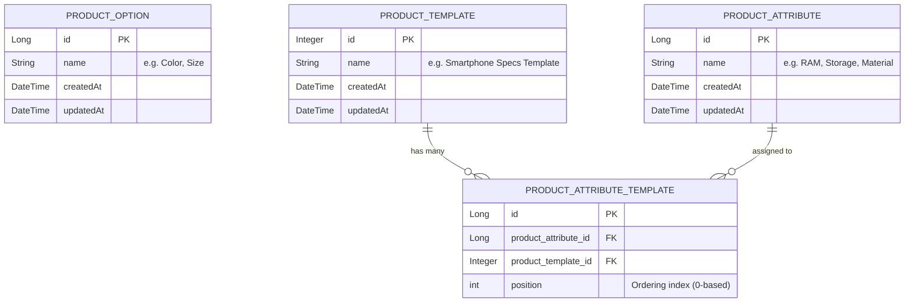
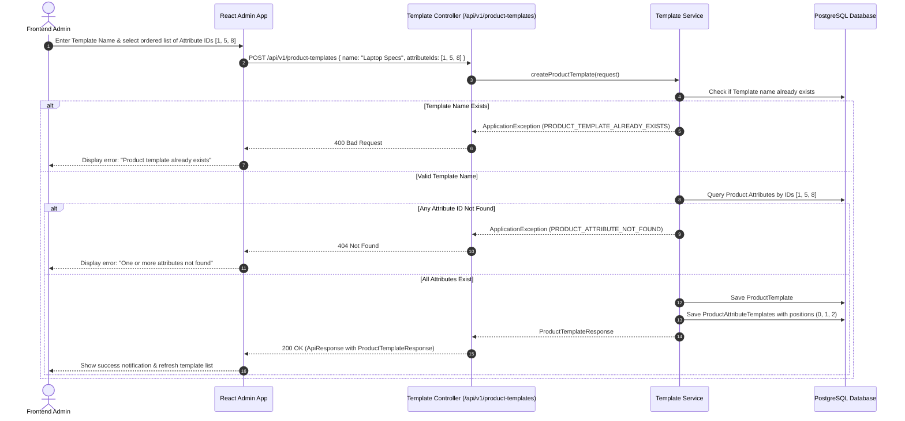

# Product Option, Attribute & Template API Integration Guide

This document provides complete API specifications, data models, error handling details, Mermaid relationship and workflow diagrams, and production-ready TypeScript / Axios / React Query integration examples for Frontend developers integrating the **Product Options**, **Product Attributes**, and **Product Templates (Attribute Templates)** modules.

---

## 1. Overview & Architecture

### Base URL & Paths
- **Base URL**: `http://localhost:8080` (or your configured environment gateway)
- **Product Options Base**: `/api/v1/product-options`
- **Product Attributes Base**: `/api/v1/product-attributes`
- **Product Templates Base**: `/api/v1/product-templates`

### Resource Identifiers & Types
| Resource | Primary Key Type | Description |
| :--- | :--- | :--- |
| **Product Option** | `Long` (number) | Variant dimension such as *Color*, *Size*, *Material* used for generating product variant combinations. |
| **Product Attribute** | `Long` (number) | Specifications or technical details of a product (e.g., *Screen Size*, *Battery Capacity*, *Warranty*). |
| **Product Template** | `Integer` (number) | Reusable template grouping multiple product attributes with preserved ordering/positions for product categories. |

### Unified Response Format
All endpoints return responses wrapped in the standard `ApiResponse<T>` envelope:

```json
{
  "status": "200",
  "message": "success",
  "data": { ... }
}
```

- **Success with Content (`200 OK`)**: `"status": "200"`, `"message": "success"`, payload in `data` (Used for get, create, and update operations).
- **Success without Content (`200 OK` with 204 status)**: `"status": "204"`, `"message": "success"`, `data: null` (Used for delete operations).
- **Pagination (`200 OK`)**: Standard `PageResponse<T>` with zero-based `pageNumber` and `pageSize`.

---

## 2. Relationships & Workflow Diagrams

### 2.1 Entity Relationship Model



### 2.2 Product Template Creation & Attribute Association Workflow



---

## 3. TypeScript Interfaces & Data Models

Place these models in your frontend shared types (e.g., `src/shared/types/catalog.ts`):

```typescript
// ==========================================
// Generic API Wrapper Types
// ==========================================
export interface ApiResponse<T> {
  status: string;
  message: string;
  data: T;
}

export interface PageResponse<T> {
  pageNumber: number;
  pageSize: number;
  totalPages: number;
  totalElements: number;
  content: T[];
}

export interface PaginationParams {
  pageNumber?: number;
  pageSize?: number;
}

// ==========================================
// Product Option Types
// ==========================================
export interface ProductOptionResponse {
  id: number; // Long in backend
  name: string;
  createdAt: string; // ISO 8601 string
  updatedAt: string; // ISO 8601 string
}

export interface ProductOptionCreateRequest {
  name: string;
}

export interface ProductOptionUpdateRequest {
  id?: number;
  name: string;
}

// ==========================================
// Product Attribute Types
// ==========================================
export interface ProductAttributeResponse {
  id: number; // Long in backend
  name: string;
  createdAt: string | null; // ISO 8601 string e.g. "2026-08-31T22:30:00+07:00"
  updatedAt: string | null; // ISO 8601 string
}

export interface ProductAttributeCreateRequest {
  name: string;
}

export interface ProductAttributeUpdateRequest {
  name: string;
}

// ==========================================
// Product Template Types
// ==========================================
export interface ProductTemplateResponse {
  id: number; // Integer in backend
  name: string;
  createdAt: string | null; // ISO 8601 string
  updatedAt: string | null; // ISO 8601 string
  attributes: ProductAttributeResponse[]; // List of associated ProductAttributes
}

export interface ProductTemplateCreateRequest {
  name: string;
  attributeIds?: number[]; // List of ProductAttribute IDs (in desired order)
}

export interface ProductTemplateUpdateRequest {
  name: string;
  attributeIds?: number[]; // Updated list of ProductAttribute IDs
}
```

---

## 4. Product Option Endpoints Specification

Base Path: `/api/v1/product-options`

### 4.1 Create Product Option
Creates a new option (e.g. *Color*, *Size*).

- **URL**: `/api/v1/product-options`
- **Method**: `POST`
- **Content-Type**: `application/json`

#### Request Body
| Field | Type | Required | Validation | Description |
| :--- | :--- | :--- | :--- | :--- |
| `name` | `string` | **Yes** | `@NotBlank`, Unique | Name of the option |

```json
{
  "name": "Color"
}
```

#### Success Response (`200 OK`)
```json
{
  "status": "200",
  "message": "success",
  "data": {
    "id": 1,
    "name": "Color",
    "createdAt": "2026-03-29T10:00:00Z",
    "updatedAt": "2026-03-29T10:00:00Z"
  }
}
```

---

### 4.2 Update Product Option
Updates an existing option by ID.

- **URL**: `/api/v1/product-options/{productOptionId}`
- **Method**: `PUT`
- **Path Variables**: `productOptionId` (number)

#### Request Body
```json
{
  "name": "Size"
}
```

#### Success Response (`200 OK`)
```json
{
  "status": "200",
  "message": "success",
  "data": {
    "id": 1,
    "name": "Size",
    "createdAt": "2026-03-29T10:00:00Z",
    "updatedAt": "2026-03-29T10:05:00Z"
  }
}
```

---

### 4.3 Get Product Option by ID
Fetches a single option by ID.

- **URL**: `/api/v1/product-options/{productOptionId}`
- **Method**: `GET`

#### Success Response (`200 OK`)
```json
{
  "status": "200",
  "message": "success",
  "data": {
    "id": 1,
    "name": "Color",
    "createdAt": "2026-03-29T10:00:00Z",
    "updatedAt": "2026-03-29T10:00:00Z"
  }
}
```

#### Error Response (`404 Not Found`)
```json
{
  "status": "404",
  "message": "Product option not found",
  "data": null
}
```

---

### 4.4 Get Paginated Product Options
Retrieves a paginated list of options.

- **URL**: `/api/v1/product-options/page`
- **Method**: `GET`
- **Query Parameters**:
  - `pageNumber` *(optional, integer, default: `0`)*
  - `pageSize` *(optional, integer, default: `10`)*

#### Success Response (`200 OK`)
```json
{
  "status": "200",
  "message": "success",
  "data": {
    "pageNumber": 0,
    "pageSize": 10,
    "totalPages": 1,
    "totalElements": 2,
    "content": [
      {
        "id": 1,
        "name": "Color",
        "createdAt": "2026-03-29T10:00:00Z",
        "updatedAt": "2026-03-29T10:00:00Z"
      },
      {
        "id": 2,
        "name": "Size",
        "createdAt": "2026-03-29T10:02:00Z",
        "updatedAt": "2026-03-29T10:02:00Z"
      }
    ]
  }
}
```

---

### 4.5 Delete Product Option
Deletes an option by ID.

- **URL**: `/api/v1/product-options/{productOptionId}`
- **Method**: `DELETE`

#### Success Response (`200 OK` with 204 status code)
```json
{
  "status": "204",
  "message": "success",
  "data": null
}
```

---

## 5. Product Attribute Endpoints Specification

Base Path: `/api/v1/product-attributes`

### 5.1 Create Product Attribute
Creates a new attribute definition (e.g. *Processor*, *RAM*, *Weight*).

- **URL**: `/api/v1/product-attributes`
- **Method**: `POST`
- **Content-Type**: `application/json`

#### Request Body
| Field | Type | Required | Validation | Description |
| :--- | :--- | :--- | :--- | :--- |
| `name` | `string` | **Yes** | `@NotBlank`, Unique | Name of the attribute |

```json
{
  "name": "RAM Capacity"
}
```

#### Success Response (`200 OK`)
```json
{
  "status": "200",
  "message": "success",
  "data": {
    "id": 1,
    "name": "RAM Capacity",
    "createdAt": "2026-08-31T21:00:00+07:00",
    "updatedAt": "2026-08-31T21:00:00+07:00"
  }
}
```

---

### 5.2 Update Product Attribute
Updates an existing attribute by ID.

- **URL**: `/api/v1/product-attributes/{productAttributeId}`
- **Method**: `PUT`
- **Path Variables**: `productAttributeId` (number)

#### Request Body
```json
{
  "name": "System Memory (RAM)"
}
```

#### Success Response (`200 OK`)
```json
{
  "status": "200",
  "message": "success",
  "data": {
    "id": 1,
    "name": "System Memory (RAM)",
    "createdAt": "2026-08-31T21:00:00+07:00",
    "updatedAt": "2026-08-31T21:10:00+07:00"
  }
}
```

---

### 5.3 Get Product Attribute by ID
Fetches details of a single attribute by ID.

- **URL**: `/api/v1/product-attributes/{productAttributeId}`
- **Method**: `GET`

#### Success Response (`200 OK`)
```json
{
  "status": "200",
  "message": "success",
  "data": {
    "id": 1,
    "name": "RAM Capacity",
    "createdAt": "2026-08-31T21:00:00+07:00",
    "updatedAt": "2026-08-31T21:00:00+07:00"
  }
}
```

#### Error Response (`404 Not Found`)
```json
{
  "status": "404",
  "message": "Product attribute not found",
  "data": null
}
```

---

### 5.4 Get Paginated Product Attributes
Retrieves a paginated list of attributes.

- **URL**: `/api/v1/product-attributes/page`
- **Method**: `GET`
- **Query Parameters**:
  - `pageNumber` *(optional, integer, default: `0`)*
  - `pageSize` *(optional, integer, default: `10`)*

#### Success Response (`200 OK`)
```json
{
  "status": "200",
  "message": "success",
  "data": {
    "pageNumber": 0,
    "pageSize": 10,
    "totalPages": 1,
    "totalElements": 2,
    "content": [
      {
        "id": 1,
        "name": "RAM Capacity",
        "createdAt": "2026-08-31T21:00:00+07:00",
        "updatedAt": "2026-08-31T21:00:00+07:00"
      },
      {
        "id": 2,
        "name": "Screen Size",
        "createdAt": "2026-08-31T21:05:00+07:00",
        "updatedAt": "2026-08-31T21:05:00+07:00"
      }
    ]
  }
}
```

---

### 5.5 Delete Product Attribute
Deletes an attribute by ID.

- **URL**: `/api/v1/product-attributes/{productAttributeId}`
- **Method**: `DELETE`

#### Success Response (`200 OK` with 204 status code)
```json
{
  "status": "204",
  "message": "success",
  "data": null
}
```

---

## 6. Product Template (Attribute Template) Endpoints Specification

Base Path: `/api/v1/product-templates`

### 6.1 Create Product Template
Creates a new template and associates an ordered list of attribute IDs.

- **URL**: `/api/v1/product-templates`
- **Method**: `POST`
- **Content-Type**: `application/json`

#### Request Body
| Field | Type | Required | Validation | Description |
| :--- | :--- | :--- | :--- | :--- |
| `name` | `string` | **Yes** | `@NotBlank`, Unique | Template name (e.g., *Laptop Specifications*) |
| `attributeIds` | `number[]` | No | List of valid Attribute IDs | Ordered list of ProductAttribute IDs assigned to this template |

```json
{
  "name": "Laptop Specifications",
  "attributeIds": [1, 2, 5]
}
```

#### Success Response (`200 OK`)
```json
{
  "status": "200",
  "message": "success",
  "data": {
    "id": 1,
    "name": "Laptop Specifications",
    "createdAt": "2026-08-31T21:10:00+07:00",
    "updatedAt": "2026-08-31T21:10:00+07:00",
    "attributes": [
      {
        "id": 1,
        "name": "Processor",
        "createdAt": "2026-08-31T20:00:00+07:00",
        "updatedAt": "2026-08-31T20:00:00+07:00"
      },
      {
        "id": 2,
        "name": "RAM",
        "createdAt": "2026-08-31T20:05:00+07:00",
        "updatedAt": "2026-08-31T20:05:00+07:00"
      },
      {
        "id": 5,
        "name": "Storage",
        "createdAt": "2026-08-31T20:10:00+07:00",
        "updatedAt": "2026-08-31T20:10:00+07:00"
      }
    ]
  }
}
```

---

### 6.2 Update Product Template
Updates the template name and updates the assigned attributes list with their positions.

- **URL**: `/api/v1/product-templates/{productTemplateId}`
- **Method**: `PUT`
- **Path Variables**: `productTemplateId` (number)

#### Request Body
```json
{
  "name": "Laptop Specifications v2",
  "attributeIds": [2, 1, 6]
}
```

#### Success Response (`200 OK`)
```json
{
  "status": "200",
  "message": "success",
  "data": {
    "id": 1,
    "name": "Laptop Specifications v2",
    "createdAt": "2026-08-31T21:10:00+07:00",
    "updatedAt": "2026-08-31T21:20:00+07:00",
    "attributes": [
      {
        "id": 2,
        "name": "RAM",
        "createdAt": "2026-08-31T20:05:00+07:00",
        "updatedAt": "2026-08-31T20:05:00+07:00"
      },
      {
        "id": 1,
        "name": "Processor",
        "createdAt": "2026-08-31T20:00:00+07:00",
        "updatedAt": "2026-08-31T20:00:00+07:00"
      },
      {
        "id": 6,
        "name": "GPU",
        "createdAt": "2026-08-31T20:15:00+07:00",
        "updatedAt": "2026-08-31T20:15:00+07:00"
      }
    ]
  }
}
```

---

### 6.3 Get Product Template by ID
Fetches template details along with its associated `attributeIds` array.

- **URL**: `/api/v1/product-templates/{productTemplateId}`
- **Method**: `GET`

#### Success Response (`200 OK`)
```json
{
  "status": "200",
  "message": "success",
  "data": {
    "id": 1,
    "name": "Laptop Specifications",
    "createdAt": "2026-08-31T21:10:00+07:00",
    "updatedAt": "2026-08-31T21:10:00+07:00",
    "attributes": [
      {
        "id": 1,
        "name": "RAM",
        "createdAt": "2026-08-31T20:00:00+07:00",
        "updatedAt": "2026-08-31T20:00:00+07:00"
      },
      {
        "id": 2,
        "name": "Storage",
        "createdAt": "2026-08-31T20:05:00+07:00",
        "updatedAt": "2026-08-31T20:05:00+07:00"
      }
    ]
  }
}
```

#### Error Response (`404 Not Found`)
```json
{
  "status": "404",
  "message": "Product template not found",
  "data": null
}
```

---

### 6.4 Get Paginated Product Templates
Retrieves a paginated list of templates.

- **URL**: `/api/v1/product-templates/page`
- **Method**: `GET`
- **Query Parameters**:
  - `pageNumber` *(optional, integer, default: `0`)*: Zero-based page index.
  - `pageSize` *(optional, integer, default: `10`)*: Number of items per page.
  - `is_include_attributes` *(optional, boolean, default: `false`)*: When `false` (default), `attributes` returns an empty array `[]` to optimize response size. When `true`, batch-fetches and returns the associated `ProductAttributeResponse` list for each template.

#### Success Response (`200 OK` with `is_include_attributes=true`)
```json
{
  "status": "200",
  "message": "success",
  "data": {
    "pageNumber": 0,
    "pageSize": 10,
    "totalPages": 1,
    "totalElements": 1,
    "content": [
      {
        "id": 1,
        "name": "Laptop Specifications",
        "createdAt": "2026-08-31T21:10:00+07:00",
        "updatedAt": "2026-08-31T21:10:00+07:00",
        "attributes": [
          {
            "id": 1,
            "name": "RAM",
            "createdAt": "2026-08-31T20:00:00+07:00",
            "updatedAt": "2026-08-31T20:00:00+07:00"
          },
          {
            "id": 2,
            "name": "Storage",
            "createdAt": "2026-08-31T20:05:00+07:00",
            "updatedAt": "2026-08-31T20:05:00+07:00"
          }
        ]
      }
    ]
  }
}
```

---

### 6.5 Delete Product Template
Deletes a product template and its attribute associations.

- **URL**: `/api/v1/product-templates/{productTemplateId}`
- **Method**: `DELETE`

#### Success Response (`200 OK` with 204 status code)
```json
{
  "status": "204",
  "message": "success",
  "data": null
}
```

---

## 7. Frontend Integration Examples

### 7.1 Axios Services Implementation

#### `productOptionService.ts`
```typescript
import axios from 'axios';
import {
  ApiResponse,
  PageResponse,
  PaginationParams,
  ProductOptionCreateRequest,
  ProductOptionResponse,
  ProductOptionUpdateRequest,
} from '@/shared/types/catalog';

const apiClient = axios.create({
  baseURL: 'http://localhost:8080/api/v1',
  withCredentials: true,
});

export const productOptionService = {
  getOptionsPage: async (params?: PaginationParams): Promise<PageResponse<ProductOptionResponse>> => {
    const response = await apiClient.get<ApiResponse<PageResponse<ProductOptionResponse>>>(
      '/product-options/page',
      {
        params: {
          pageNumber: params?.pageNumber ?? 0,
          pageSize: params?.pageSize ?? 10,
        },
      }
    );
    return response.data.data;
  },

  getOptionById: async (id: number): Promise<ProductOptionResponse> => {
    const response = await apiClient.get<ApiResponse<ProductOptionResponse>>(`/product-options/${id}`);
    return response.data.data;
  },

  createOption: async (payload: ProductOptionCreateRequest): Promise<ProductOptionResponse> => {
    const response = await apiClient.post<ApiResponse<ProductOptionResponse>>('/product-options', payload);
    return response.data.data;
  },

  updateOption: async (id: number, payload: ProductOptionUpdateRequest): Promise<ProductOptionResponse> => {
    const response = await apiClient.put<ApiResponse<ProductOptionResponse>>(`/product-options/${id}`, payload);
    return response.data.data;
  },

  deleteOption: async (id: number): Promise<void> => {
    await apiClient.delete<ApiResponse<void>>(`/product-options/${id}`);
  },
};
```

#### `productAttributeService.ts`
```typescript
import axios from 'axios';
import {
  ApiResponse,
  PageResponse,
  PaginationParams,
  ProductAttributeCreateRequest,
  ProductAttributeResponse,
  ProductAttributeUpdateRequest,
} from '@/shared/types/catalog';

const apiClient = axios.create({
  baseURL: 'http://localhost:8080/api/v1',
  withCredentials: true,
});

export const productAttributeService = {
  getAttributesPage: async (params?: PaginationParams): Promise<PageResponse<ProductAttributeResponse>> => {
    const response = await apiClient.get<ApiResponse<PageResponse<ProductAttributeResponse>>>(
      '/product-attributes/page',
      {
        params: {
          pageNumber: params?.pageNumber ?? 0,
          pageSize: params?.pageSize ?? 10,
        },
      }
    );
    return response.data.data;
  },

  getAttributeById: async (id: number): Promise<ProductAttributeResponse> => {
    const response = await apiClient.get<ApiResponse<ProductAttributeResponse>>(`/product-attributes/${id}`);
    return response.data.data;
  },

  createAttribute: async (payload: ProductAttributeCreateRequest): Promise<ProductAttributeResponse> => {
    const response = await apiClient.post<ApiResponse<ProductAttributeResponse>>('/product-attributes', payload);
    return response.data.data;
  },

  updateAttribute: async (id: number, payload: ProductAttributeUpdateRequest): Promise<ProductAttributeResponse> => {
    const response = await apiClient.put<ApiResponse<ProductAttributeResponse>>(`/product-attributes/${id}`, payload);
    return response.data.data;
  },

  deleteAttribute: async (id: number): Promise<void> => {
    await apiClient.delete<ApiResponse<void>>(`/product-attributes/${id}`);
  },
};
```

#### `productTemplateService.ts`
```typescript
import axios from 'axios';
import {
  ApiResponse,
  PageResponse,
  PaginationParams,
  ProductTemplateCreateRequest,
  ProductTemplateResponse,
  ProductTemplateUpdateRequest,
} from '@/shared/types/catalog';

const apiClient = axios.create({
  baseURL: 'http://localhost:8080/api/v1',
  withCredentials: true,
});

export const productTemplateService = {
  getTemplatesPage: async (params?: PaginationParams & { is_include_attributes?: boolean }): Promise<PageResponse<ProductTemplateResponse>> => {
    const response = await apiClient.get<ApiResponse<PageResponse<ProductTemplateResponse>>>(
      '/product-templates/page',
      {
        params: {
          pageNumber: params?.pageNumber ?? 0,
          pageSize: params?.pageSize ?? 10,
          is_include_attributes: params?.is_include_attributes ?? false,
        },
      }
    );
    return response.data.data;
  },

  getTemplateById: async (id: number): Promise<ProductTemplateResponse> => {
    const response = await apiClient.get<ApiResponse<ProductTemplateResponse>>(`/product-templates/${id}`);
    return response.data.data;
  },

  createTemplate: async (payload: ProductTemplateCreateRequest): Promise<ProductTemplateResponse> => {
    const response = await apiClient.post<ApiResponse<ProductTemplateResponse>>('/product-templates', payload);
    return response.data.data;
  },

  updateTemplate: async (id: number, payload: ProductTemplateUpdateRequest): Promise<ProductTemplateResponse> => {
    const response = await apiClient.put<ApiResponse<ProductTemplateResponse>>(`/product-templates/${id}`, payload);
    return response.data.data;
  },

  deleteTemplate: async (id: number): Promise<void> => {
    await apiClient.delete<ApiResponse<void>>(`/product-templates/${id}`);
  },
};
```

---

### 7.2 TanStack Query (React Query) Hooks

#### `useProductOptionQueries.ts`
```typescript
import { useQuery, useMutation, useQueryClient } from '@tanstack/react-query';
import { productOptionService } from '@/shared/services/api/productOptionService';
import { PaginationParams, ProductOptionCreateRequest, ProductOptionUpdateRequest } from '@/shared/types/catalog';

export const OPTION_QUERY_KEY = 'product-options';

export const useProductOptionPageQuery = (params: PaginationParams) => {
  return useQuery({
    queryKey: [OPTION_QUERY_KEY, 'page', params],
    queryFn: () => productOptionService.getOptionsPage(params),
  });
};

export const useProductOptionDetailQuery = (id: number, enabled = true) => {
  return useQuery({
    queryKey: [OPTION_QUERY_KEY, 'detail', id],
    queryFn: () => productOptionService.getOptionById(id),
    enabled: !!id && enabled,
  });
};

export const useCreateProductOptionMutation = () => {
  const queryClient = useQueryClient();
  return useMutation({
    mutationFn: (payload: ProductOptionCreateRequest) => productOptionService.createOption(payload),
    onSuccess: () => {
      queryClient.invalidateQueries({ queryKey: [OPTION_QUERY_KEY] });
    },
  });
};

export const useUpdateProductOptionMutation = () => {
  const queryClient = useQueryClient();
  return useMutation({
    mutationFn: ({ id, payload }: { id: number; payload: ProductOptionUpdateRequest }) =>
      productOptionService.updateOption(id, payload),
    onSuccess: () => {
      queryClient.invalidateQueries({ queryKey: [OPTION_QUERY_KEY] });
    },
  });
};

export const useDeleteProductOptionMutation = () => {
  const queryClient = useQueryClient();
  return useMutation({
    mutationFn: (id: number) => productOptionService.deleteOption(id),
    onSuccess: () => {
      queryClient.invalidateQueries({ queryKey: [OPTION_QUERY_KEY] });
    },
  });
};
```

#### `useProductAttributeQueries.ts`
```typescript
import { useQuery, useMutation, useQueryClient } from '@tanstack/react-query';
import { productAttributeService } from '@/shared/services/api/productAttributeService';
import { PaginationParams, ProductAttributeCreateRequest, ProductAttributeUpdateRequest } from '@/shared/types/catalog';

export const ATTRIBUTE_QUERY_KEY = 'product-attributes';

export const useProductAttributePageQuery = (params: PaginationParams) => {
  return useQuery({
    queryKey: [ATTRIBUTE_QUERY_KEY, 'page', params],
    queryFn: () => productAttributeService.getAttributesPage(params),
  });
};

export const useProductAttributeDetailQuery = (id: number, enabled = true) => {
  return useQuery({
    queryKey: [ATTRIBUTE_QUERY_KEY, 'detail', id],
    queryFn: () => productAttributeService.getAttributeById(id),
    enabled: !!id && enabled,
  });
};

export const useCreateProductAttributeMutation = () => {
  const queryClient = useQueryClient();
  return useMutation({
    mutationFn: (payload: ProductAttributeCreateRequest) => productAttributeService.createAttribute(payload),
    onSuccess: () => {
      queryClient.invalidateQueries({ queryKey: [ATTRIBUTE_QUERY_KEY] });
    },
  });
};

export const useUpdateProductAttributeMutation = () => {
  const queryClient = useQueryClient();
  return useMutation({
    mutationFn: ({ id, payload }: { id: number; payload: ProductAttributeUpdateRequest }) =>
      productAttributeService.updateAttribute(id, payload),
    onSuccess: () => {
      queryClient.invalidateQueries({ queryKey: [ATTRIBUTE_QUERY_KEY] });
    },
  });
};

export const useDeleteProductAttributeMutation = () => {
  const queryClient = useQueryClient();
  return useMutation({
    mutationFn: (id: number) => productAttributeService.deleteAttribute(id),
    onSuccess: () => {
      queryClient.invalidateQueries({ queryKey: [ATTRIBUTE_QUERY_KEY] });
    },
  });
};
```

#### `useProductTemplateQueries.ts`
```typescript
import { useQuery, useMutation, useQueryClient } from '@tanstack/react-query';
import { productTemplateService } from '@/shared/services/api/productTemplateService';
import { PaginationParams, ProductTemplateCreateRequest, ProductTemplateUpdateRequest } from '@/shared/types/catalog';

export const TEMPLATE_QUERY_KEY = 'product-templates';

export const useProductTemplatePageQuery = (params: PaginationParams) => {
  return useQuery({
    queryKey: [TEMPLATE_QUERY_KEY, 'page', params],
    queryFn: () => productTemplateService.getTemplatesPage(params),
  });
};

export const useProductTemplateDetailQuery = (id: number, enabled = true) => {
  return useQuery({
    queryKey: [TEMPLATE_QUERY_KEY, 'detail', id],
    queryFn: () => productTemplateService.getTemplateById(id),
    enabled: !!id && enabled,
  });
};

export const useCreateProductTemplateMutation = () => {
  const queryClient = useQueryClient();
  return useMutation({
    mutationFn: (payload: ProductTemplateCreateRequest) => productTemplateService.createTemplate(payload),
    onSuccess: () => {
      queryClient.invalidateQueries({ queryKey: [TEMPLATE_QUERY_KEY] });
    },
  });
};

export const useUpdateProductTemplateMutation = () => {
  const queryClient = useQueryClient();
  return useMutation({
    mutationFn: ({ id, payload }: { id: number; payload: ProductTemplateUpdateRequest }) =>
      productTemplateService.updateTemplate(id, payload),
    onSuccess: () => {
      queryClient.invalidateQueries({ queryKey: [TEMPLATE_QUERY_KEY] });
    },
  });
};

export const useDeleteProductTemplateMutation = () => {
  const queryClient = useQueryClient();
  return useMutation({
    mutationFn: (id: number) => productTemplateService.deleteTemplate(id),
    onSuccess: () => {
      queryClient.invalidateQueries({ queryKey: [TEMPLATE_QUERY_KEY] });
    },
  });
};
```

---

## 8. Error Codes Reference

| Error Code | HTTP Status | Backend Reason | Recommended Frontend UI Action |
| :--- | :--- | :--- | :--- |
| `INVALID_PRODUCT_OPTION` | `400 Bad Request` | Option name is blank or invalid. | Show input validation error under the Option Name input. |
| `PRODUCT_OPTION_ALREADY_EXISTS` | `400 Bad Request` | An option with the specified name already exists. | Display duplicate warning: *"Option name already exists."* |
| `PRODUCT_OPTION_NOT_FOUND` | `404 Not Found` | No product option found for the provided ID. | Show 404 notification or redirect back to option list. |
| `INVALID_PRODUCT_ATTRIBUTE` | `400 Bad Request` | Attribute name is blank or invalid. | Show input validation error under the Attribute Name input. |
| `PRODUCT_ATTRIBUTE_ALREADY_EXISTS` | `400 Bad Request` | An attribute with the specified name already exists. | Display duplicate warning: *"Attribute name already exists."* |
| `PRODUCT_ATTRIBUTE_NOT_FOUND` | `404 Not Found` | Attribute ID not found (either in direct lookups or within a template's `attributeIds` list). | Highlight missing attribute or notify that referenced attribute no longer exists. |
| `INVALID_PRODUCT_TEMPLATE` | `400 Bad Request` | Template name is blank or payload is malformed. | Show form validation error. |
| `PRODUCT_TEMPLATE_ALREADY_EXISTS` | `400 Bad Request` | A template with the specified name already exists. | Display duplicate warning: *"Template name already exists."* |
| `PRODUCT_TEMPLATE_NOT_FOUND` | `404 Not Found` | No template found for the given template ID. | Show 404 notification. |
