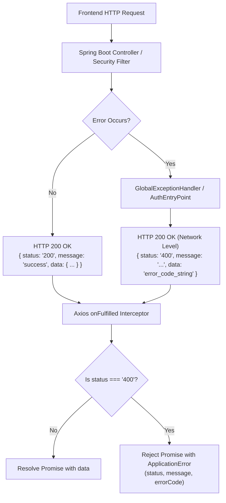
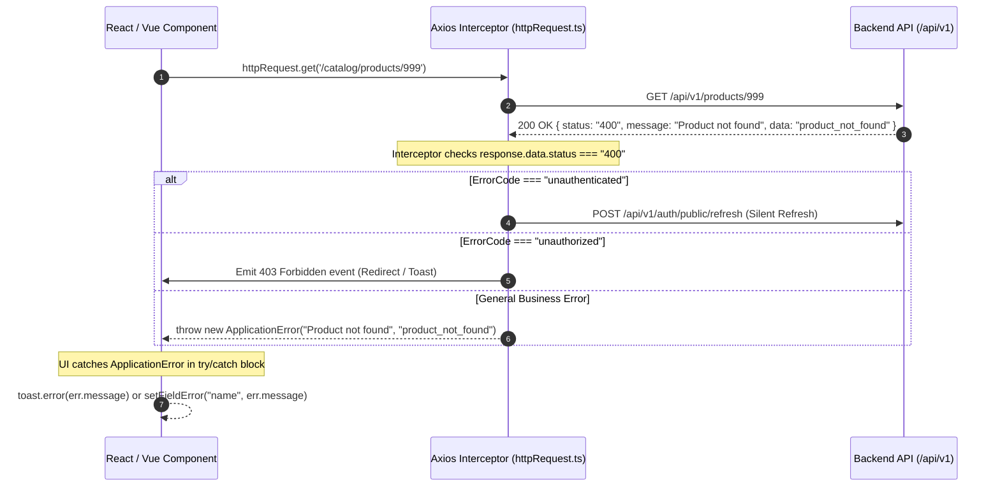

# API Response & Error Handling Integration Guide

This guide details the backend's unified response structure, the **in-envelope error model**, the complete **ErrorCode dictionary**, and provides production-ready **TypeScript / Axios integration code** for frontend developers integrating with `ecommerce-be`.

---

## 1. Response Envelope Anatomy

Every endpoint in the `ecommerce-be` API returns data wrapped in a unified envelope: `ApiResponse<T>`.

```typescript
export interface ApiResponse<T> {
  status: "200" | "204" | "400";
  message: string;
  data: T;
}
```

The backend operates across **three primary response states**:

| State | Envelope `status` | Network HTTP Code | `message` | `data` Content | Typical Scenario |
| :--- | :---: | :---: | :--- | :--- | :--- |
| **Success with Content** | `"200"` | `200 OK` | `"success"` | Payload object / array / string | `GET /brands`, `POST /auth/public/sign-in` |
| **Success No Content** | `"204"` | `200 OK` | `"success"` | `null` | `PUT /brands/{id}`, `DELETE /brands/{id}`, `POST /auth/sign-out` |
| **Business / Validation Error** | `"400"` | `200 OK` | Human-readable explanation | **Machine ErrorCode string** | Invalid input, not found, unauthenticated, file too large |

---

## 2. In-Envelope Error Format

### 2.1 The Error Payload Structure

When an error occurs (such as an `ApplicationException`, validation error, or authentication failure), the backend returns:

```json
{
  "status": "400",
  "message": "Product with ID 3fa85f64-5717-4562-b3fc-2c963f66afa6 not found",
  "data": "product_not_found"
}
```

Notice the key role of each field:
1. **`status: "400"`**: Signals to the client that this operation failed.
2. **`message`**: A localized or formatted human-readable description intended for debug logs or direct UI toast notifications (e.g. `"Email or password is incorrect"`).
3. **`data`**: **The programmatic Error Code identifier** (e.g. `"product_not_found"`, `"unauthenticated"`, `"bad_request"`). The frontend uses this string to run `switch/case` logic, field mapping, or customized UI workflows.

### 2.2 Why Network Status is `200 OK`
The backend's centralized `GlobalExceptionHandler`, `AuthEntryPointException`, and `AccessDeniedException` format responses via `ResponseEntity.ok(...)`. 



> [!IMPORTANT]
> Because the network status code is `200 OK`, standard HTTP clients (like Axios or Fetch) will pass the response to the **success handler (`onFulfilled`)** rather than the error handler (`onRejected`).
> 
> Therefore, your HTTP client **must inspect `response.data.status` in an interceptor** to normalize errors into rejected Promises so your UI components can catch them naturally using `try/catch`.

---

## 3. Frontend Error Processing Pipeline



---

## 4. Complete Backend Error Code Dictionary

Below is the complete reference of all error codes returned in `response.data.data` when `status === "400"`:

### 4.1 Security & Authentication

| Machine Error Code (`data`) | Default Backend Message | Cause / Scenario | Recommended Frontend Handling |
| :--- | :--- | :--- | :--- |
| `unauthenticated` | `"Unauthenticated"` | Missing, invalid, or expired Access Token | Trigger silent refresh or redirect to `/login` |
| `unauthorized` | `"You don't have permission"` | Current user lacks required role/permission | Display "Access Denied" page or notification |
| `incorrect_password` | `"Incorrect password"` | Wrong password entered during sign-in | Display "Email or password is incorrect" |
| `invalid_token` | `"Invalid token"` | Refresh token or password reset token is expired/invalid | Force redirect to `/login` |
| `invalid_email` | `"Invalid email"` | Email already registered during sign-up | Highlight email input field with error |
| `invalid_code` | `"Invalid code"` | Wrong 6-digit email OTP or 2FA TOTP code | Prompt user to re-enter code |
| `invalid_provider` | `"Looks like you're signed up with %s account..."` | Attempting password sign-in when account is bound to OAuth (Google/GitHub/Facebook) | Guide user to click social login button |
| `user_not_found` | `"User not found"` | User ID or email does not exist | Display user lookup error |
| `admin_profile_not_found` | `"Admin profile not found"` | User has no admin profile record | Alert user / contact system administrator |

### 4.2 System & Generic

| Machine Error Code (`data`) | Default Backend Message | Cause / Scenario | Recommended Frontend Handling |
| :--- | :--- | :--- | :--- |
| `bad_request` | `"Bad request"` | DTO validation failed (`@NotBlank`, `@Pattern`) | Parse error message or highlight form inputs |
| `internal_error` | `"Uncategorized error"` | Unhandled server exception (500) | Display generic "Something went wrong" toast |

### 4.3 Media & File Uploads

| Machine Error Code (`data`) | Default Backend Message | Cause / Scenario | Recommended Frontend Handling |
| :--- | :--- | :--- | :--- |
| `invalid_media_type` | `"Invalid media type: %s"` | Uploaded file is not an allowed image or MP4 video | Show validation warning (Only images and MP4 accepted) |
| `file_too_large` | `"File size exceeds maximum allowed limit: %s"` | File exceeds 10MB (images) or 50MB (videos) | Show size limitation error |
| `max_upload_size_exceeded` | `"Maximum upload size exceeded"` | File exceeds Spring multipart threshold (50MB) | Reject file upload before sending |
| `media_not_found` | `"Media not found"` | Media ID does not exist | Show broken media placeholder |

### 4.4 Catalog & Products

| Machine Error Code (`data`) | Default Backend Message | Cause / Scenario | Recommended Frontend Handling |
| :--- | :--- | :--- | :--- |
| `invalid_product` | `"Invalid product data"` | Product data constraints failed | Highlight product form fields |
| `product_not_found` | `"Product not found"` | Product ID does not exist | Show 404 Not Found screen |
| `product_already_exists` | `"Product already exists"` | Product with matching unique constraint exists | Highlight duplicate name field |
| `invalid_category` | `"Invalid category data"` | Category data validation failed | Highlight category form fields |
| `category_not_found` | `"Category not found"` | Category ID does not exist | Show category not found notification |
| `category_already_exists` | `"Category already exists"` | Category name / slug already taken | Alert user to change category name |
| `invalid_brand` | `"Invalid brand data"` | Brand validation failed | Highlight brand form fields |
| `brand_not_found` | `"Brand not found"` | Brand ID does not exist | Show brand not found notification |
| `brand_already_exists` | `"Brand already exists"` | Brand name already exists | Alert user to change brand name |
| `invalid_product_attribute` | `"Invalid product attribute data"` | Attribute validation failed | Highlight attribute form fields |
| `product_attribute_not_found` | `"Product attribute not found"` | Attribute ID does not exist | Show attribute missing message |
| `product_attribute_already_exists` | `"Product attribute already exists"` | Attribute name already exists | Alert user of existing attribute |
| `invalid_product_template` | `"Invalid product template data"` | Template validation failed | Highlight template form fields |
| `product_template_not_found` | `"Product template not found"` | Template ID does not exist | Show template missing message |
| `product_template_already_exists` | `"Product template already exists"` | Template name already exists | Alert user of duplicate template |
| `invalid_product_option` | `"Invalid product option data"` | Option validation failed | Highlight option form fields |
| `product_option_not_found` | `"Product option not found"` | Option ID does not exist | Show option missing message |
| `product_option_already_exists` | `"Product option already exists"` | Option name already exists | Alert user of duplicate option |

### 4.5 Roles & Permissions

| Machine Error Code (`data`) | Default Backend Message | Cause / Scenario | Recommended Frontend Handling |
| :--- | :--- | :--- | :--- |
| `role_not_found` | `"Role not found"` | Role ID does not exist | Show role lookup error |
| `role_already_exists` | `"Role already exists"` | Role name already exists | Highlight role name input |
| `role_cannot_be_deleted` | `"Role cannot be deleted"` | Attempting to delete system or assigned role | Alert user that role is in use |
| `permission_not_found` | `"Permission not found"` | Permission ID does not exist | Highlight invalid permission |


