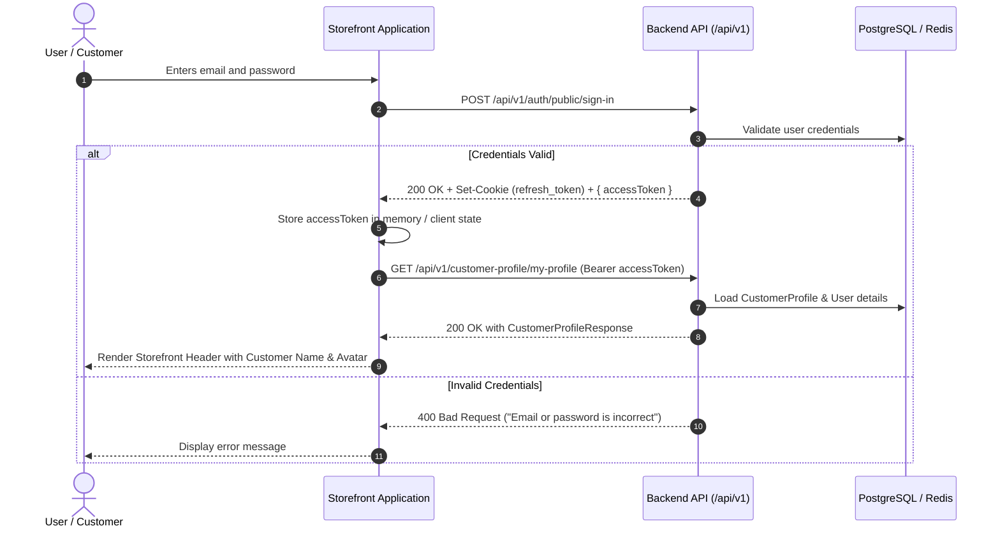
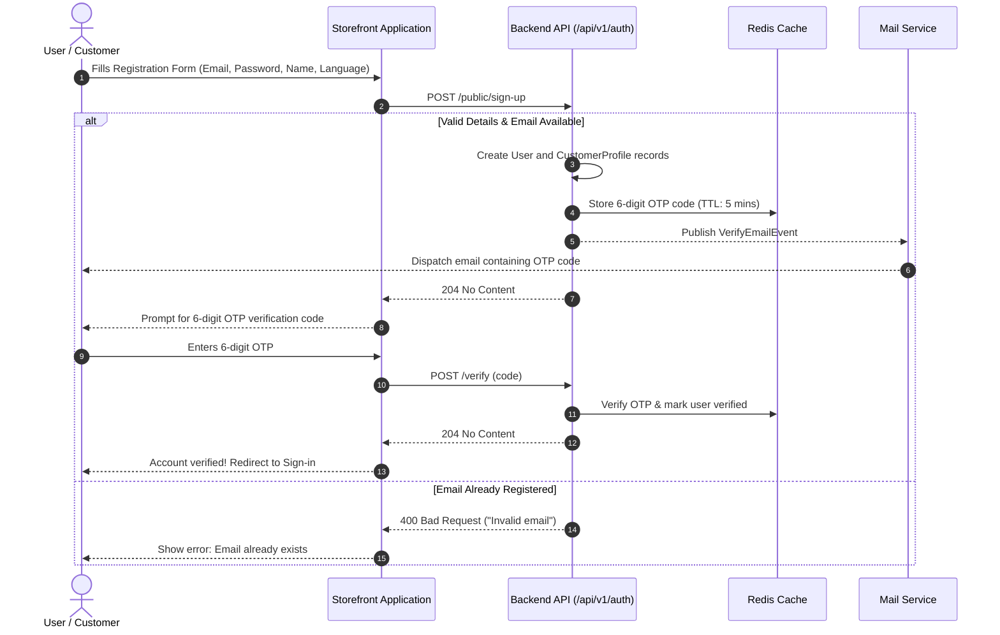
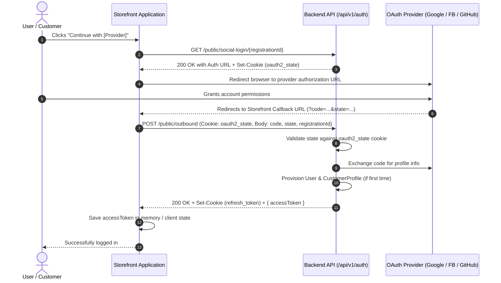
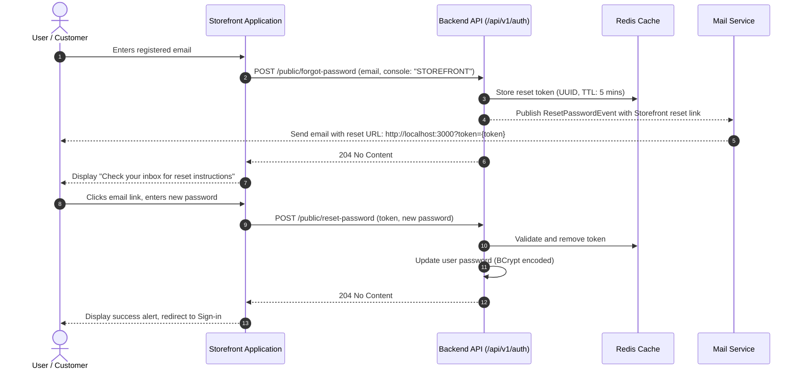
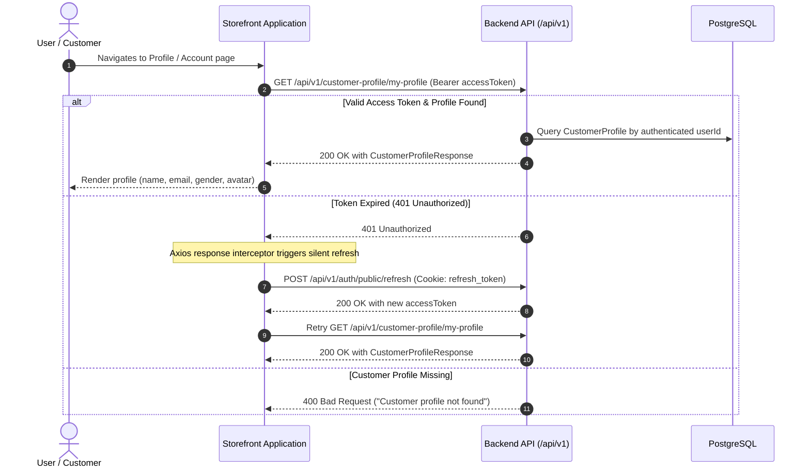

# User Console (Storefront) Authentication & Customer Profile API Integration Guide

This integration guide provides complete API technical specifications for Frontend developers building the **User Console (Storefront / Customer Portal)**.


It covers all core customer authentication workflows:
- **Sign-in**
- **Sign-up**
- **Social Login** (Google, Facebook, GitHub)
- **Forgot Password**
- **Reset Password**
- **Customer Profile** (Get My Profile)
- **Related Session Management** (Email Verification, Token Refresh, Sign Out)

---

## 1. Overview & Architecture

### Base URL
- **Local / Development**: `http://localhost:8080/api/v1`
- **Storefront Client URL**: `http://localhost:3000`

### Security & Token Mechanism
- **Access Token (JWT)**:
  - Short-lived token returned in the response body (`data.accessToken`).
  - Required in the `Authorization` header for protected endpoints:
    ```http
    Authorization: Bearer <accessToken>
    ```
- **Refresh Token (HttpOnly Cookie)**:
  - Issued upon successful authentication (Sign-in, Social Login).
  - Stored in an `HttpOnly`, `SameSite` cookie named `refresh_token`.
  - Sent automatically by browsers when requests include credentials:
    - Axios: `withCredentials: true`
    - Fetch API: `credentials: "include"`
- **OAuth2 CSRF Protection (`oauth2_state`)**:
  - A secure state cookie set by the backend when initiating social login to prevent CSRF attacks during the OAuth callback.

### Unified Response Envelope
All backend endpoints wrap responses in a standardized envelope:
```json
{
  "status": "200",
  "message": "success",
  "data": { ... }
}
```
- **Success with payload**: `status` is `"200"`, `message` is `"success"`, and `data` contains the payload.
- **Success without payload**: `status` is `"204"`, `message` is `"success"`, and `data` is `null`.
- **Error**: `status` is `"400"`, `message` describes the failure, and `data` contains the error code string (e.g., `"invalid_email"`, `"bad_request"`).

---

## 2. Authentication Flowcharts

### 2.1 Sign-In & Customer Profile Fetching Flow


---

### 2.2 Sign-Up & Email Verification Flow


---

### 2.3 Social Login (OAuth2 Outbound) Flow


---

### 2.4 Forgot Password & Reset Password Flow


---

### 2.5 Customer Profile Fetching Flow


---

## 3. Core Authentication API Specifications

### 3.1 Sign In
Authenticates customer credentials, returns a short-lived Access Token in response body, and sets an HttpOnly Refresh Token cookie.

- **API Path**: `/api/v1/auth/public/sign-in`
- **Method**: `POST`
- **Auth Required**: `No` (Public)
- **Content-Type**: `application/json`

#### Request Body
| Field | Type | Required | Constraints | Description |
| :--- | :--- | :--- | :--- | :--- |
| `email` | string | Yes | Valid email format, not blank | Customer's registered email address |
| `password` | string | Yes | Not blank | Customer's account password |

**Validation Rules**:
- `email`: `@NotBlank(message = "{fieldName} cannot be empty")`, `@Email(message = "{fieldName} is invalid email format")`
- `password`: `@NotBlank(message = "{fieldName} cannot be empty")`

**Example Request**:
```json
{
  "email": "customer@example.com",
  "password": "Password123!"
}
```

#### Response
- **Headers**:
  ```http
  Set-Cookie: refresh_token=<refreshToken>; Path=/; HttpOnly; SameSite=Lax; Max-Age=604800
  ```

**Success Response (200 OK)**:
```json
{
  "status": "200",
  "message": "success",
  "data": {
    "accessToken": "eyJhbGciOiJIUzI1NiJ9.eyJzdWIiOiJjdXN0b21lckBleGFtcGxlLmNvbSIsImV4cCI6MTcxMDk5OTk5OX0..."
  }
}
```

**Error Response (400 Bad Request - Invalid Credentials)**:
```json
{
  "status": "400",
  "message": "Email or password is incorrect",
  "data": "bad_request"
}
```

**Error Response (400 Bad Request - Validation Failure)**:
```json
{
  "status": "400",
  "message": "Bad request",
  "data": "bad_request"
}
```

---

### 3.2 Sign Up (Customer Registration)
Registers a new customer account, creates a corresponding `CustomerProfile`, and triggers an asynchronous verification email containing a 6-digit OTP code.

- **API Path**: `/api/v1/auth/public/sign-up`
- **Method**: `POST`
- **Auth Required**: `No` (Public)
- **Content-Type**: `application/json`

#### Request Body
| Field | Type | Required | Constraints | Description |
| :--- | :--- | :--- | :--- | :--- |
| `email` | string | Yes | Valid email format, not blank | Customer's registration email address |
| `password` | string | Yes | Min 8 chars, 1 uppercase, 1 lowercase, 1 digit, 1 special character | Customer's new password |
| `name` | string | Yes | Not blank | Customer's full display name |
| `language` | string | Yes | Must be `"EN"` or `"VI"` | Customer's preferred interface language |

**Validation Rules**:
- `email`: `@NotBlank`, `@Email`
- `password`: `@NotBlank`, `@Pattern(regexp = "^(?=.*[a-z])(?=.*[A-Z])(?=.*\\d)(?=.*[^A-Za-z0-9]).{8,}$", message = "Password must have at least 1 lowercase letter, 1 uppercase letter, 1 number, 1 special character and minimum 8 characters")`
- `name`: `@NotBlank`
- `language`: `@NotBlank`, `@ValidateEnum(enumClass = Language.class, message = "Language must be one of: EN, VI")`

**Example Request**:
```json
{
  "email": "customer@example.com",
  "password": "SecurePassword123!",
  "name": "Jane Doe",
  "language": "EN"
}
```

#### Response

**Success Response (204 No Content)**:
```json
{
  "status": "204",
  "message": "success",
  "data": null
}
```

**Error Response (400 Bad Request - Email Already Taken)**:
```json
{
  "status": "400",
  "message": "Invalid email",
  "data": "invalid_email"
}
```

**Error Response (400 Bad Request - Weak Password)**:
```json
{
  "status": "400",
  "message": "Password must have at least 1 lowercase letter, 1 uppercase letter, 1 number, 1 special character and minimum 8 characters",
  "data": "bad_request"
}
```

---

### 3.3 Social Login APIs

Social authentication operates in two steps: initiating the authorization redirect, followed by exchanging the returned authorization code for authentication tokens.

#### 3.3.1 Start Social Login
Generates the OAuth2 authorization URL for the requested provider and sets a state verification cookie (`oauth2_state`) to prevent CSRF attacks.

- **API Path**: `/api/v1/auth/public/social-login/{registrationId}`
- **Method**: `GET`
- **Auth Required**: `No` (Public)
- **Path Parameters**:
  | Parameter | Type | Required | Values | Description |
  | :--- | :--- | :--- | :--- | :--- |
  | `registrationId` | string | Yes | `google`, `facebook`, `github` | Identity provider identifier (case-insensitive) |

#### Response
- **Headers**:
  ```http
  Set-Cookie: oauth2_state=<stateToken>; Path=/; SameSite=Lax
  ```

**Success Response (200 OK)**:
```json
{
  "status": "200",
  "message": "success",
  "data": "https://accounts.google.com/o/oauth2/v2/auth?response_type=code&client_id=123456.apps.googleusercontent.com&scope=email%20profile&state=a1b2c3d4e5&redirect_uri=http://localhost:3000/oauth2/callback/google"
}
```

> **Client Action**: Frontend redirects user's browser window to the URL returned in `data`.

---

#### 3.3.2 Complete Social Login (Outbound Authentication Callback)
Exchanges the authorization `code` and `state` returned by the provider for backend session tokens. If the customer does not exist, an account and `CustomerProfile` are created automatically.

- **API Path**: `/api/v1/auth/public/outbound`
- **Method**: `POST`
- **Auth Required**: `No` (Public)
- **Content-Type**: `application/json`
- **Required Cookie**: `oauth2_state` (must match the `state` field in request body)

#### Request Body
| Field | Type | Required | Constraints | Description |
| :--- | :--- | :--- | :--- | :--- |
| `code` | string | Yes | Not blank | Authorization code returned by OAuth provider in redirect URL |
| `state` | string | Yes | Not blank | State token returned by OAuth provider (must match `oauth2_state` cookie) |
| `registrationId` | string | Yes | Not blank (`google`, `facebook`, `github`) | Identifier of the OAuth provider used |

**Validation Rules**:
- `code`: `@NotBlank`
- `state`: `@NotBlank`
- `registrationId`: `@NotBlank`

**Example Request**:
```json
{
  "code": "4/0AfJohXmQ2...",
  "state": "a1b2c3d4e5",
  "registrationId": "google"
}
```

#### Response
- **Headers**:
  ```http
  Set-Cookie: refresh_token=<refreshToken>; Path=/; HttpOnly; SameSite=Lax; Max-Age=604800
  Set-Cookie: oauth2_state=; Max-Age=0; Expires=Thu, 01 Jan 1970 00:00:00 GMT
  ```

**Success Response (200 OK)**:
```json
{
  "status": "200",
  "message": "success",
  "data": {
    "accessToken": "eyJhbGciOiJIUzI1NiJ9.eyJzdWIiOiJjdXN0b21lckBleGFtcGxlLmNvbSI..."
  }
}
```

**Error Response (400 Bad Request - Provider Conflict)**:
Occurs if the user registered originally with another provider or standard email/password.
```json
{
  "status": "400",
  "message": "Looks like you're signed up with LOCAL account. Please use your LOCAL account to login.",
  "data": "invalid_provider"
}
```

**Error Response (400 Bad Request - State Mismatch / Invalid Code)**:
```json
{
  "status": "400",
  "message": "Uncategorized error",
  "data": "internal_error"
}
```

---

### 3.4 Forgot Password
Requests a password reset link for a registered customer account. The backend generates a secure token stored in Redis (TTL: 5 minutes) and dispatches an email containing the reset link configured for the Storefront console.

- **API Path**: `/api/v1/auth/public/forgot-password`
- **Method**: `POST`
- **Auth Required**: `No` (Public)
- **Content-Type**: `application/json`

#### Request Body
| Field | Type | Required | Constraints | Description |
| :--- | :--- | :--- | :--- | :--- |
| `email` | string | Yes | Valid email format | Registered customer email address |
| `console` | string | No | `"STOREFRONT"` or omit | Target console. Defaults to storefront (`http://localhost:3000?token={token}`) |

**Validation Rules**:
- `email`: `@Email(message = "{fieldName} is invalid email format")`

**Example Request**:
```json
{
  "email": "customer@example.com",
  "console": "STOREFRONT"
}
```

#### Response

**Success Response (204 No Content)**:
```json
{
  "status": "204",
  "message": "success",
  "data": null
}
```

**Error Response (400 Bad Request - User Not Found)**:
```json
{
  "status": "400",
  "message": "User not found",
  "data": "user_not_found"
}
```

---

### 3.5 Reset Password
Resets the customer's password using the one-time token received from the reset email link.

- **API Path**: `/api/v1/auth/public/reset-password`
- **Method**: `POST`
- **Auth Required**: `No` (Public)
- **Content-Type**: `application/json`

#### Request Body
| Field | Type | Required | Constraints | Description |
| :--- | :--- | :--- | :--- | :--- |
| `token` | string | Yes | Valid unexpired reset token | Token extracted from email reset link query parameter (`?token=...`) |
| `password` | string | Yes | Min 8 chars, 1 uppercase, 1 lowercase, 1 digit, 1 special character | Customer's new password |

**Validation Rules**:
- `token`: Must exist in Redis cache and not be expired.
- `password`: `@NotBlank`, `@Pattern(regexp = "^(?=.*[a-z])(?=.*[A-Z])(?=.*\\d)(?=.*[^A-Za-z0-9]).{8,}$", message = "Password must have at least 1 lowercase letter, 1 uppercase letter, 1 number, 1 special character and minimum 8 characters")`

**Example Request**:
```json
{
  "token": "d7b1b11b-87b6-4b8c-9c98-1e432a13f231",
  "password": "NewSecretPassword123!"
}
```

#### Response

**Success Response (204 No Content)**:
```json
{
  "status": "204",
  "message": "success",
  "data": null
}
```

**Error Response (400 Bad Request - Invalid or Expired Token)**:
```json
{
  "status": "400",
  "message": "Invalid token",
  "data": "invalid_token"
}
```

**Error Response (400 Bad Request - Weak Password)**:
```json
{
  "status": "400",
  "message": "Password must have at least 1 lowercase letter, 1 uppercase letter, 1 number, 1 special character and minimum 8 characters",
  "data": "bad_request"
}
```

---

## 4. Customer Profile API Specification

### 4.1 Get Customer Profile (My Profile)
Retrieves the profile information of the currently authenticated customer.

- **API Path**: `/api/v1/customer-profile/my-profile`
- **Method**: `GET`
- **Auth Required**: `Yes`
- **Request Headers**:
  ```http
  Authorization: Bearer <accessToken>
  ```

#### Request Parameters / Body
None. The customer identity is extracted securely from the JWT subject (`@ActiveUser AuthUser authUser`).

#### Validation & Authentication Rules
- The request must contain a valid, unexpired Bearer JWT token in the `Authorization` header.
- The authenticated user account must exist in the database; otherwise `user_not_found` is returned.
- A corresponding customer profile must exist for the user in `tbl_customer_profile`; otherwise `customer_profile_not_found` is returned.

#### Response Body
| Field | Type | Required | Description |
| :--- | :--- | :--- | :--- |
| `userId` | UUID (string) | Yes | Unique identifier of the customer account |
| `email` | string | Yes | Customer's registered email address |
| `name` | string | Yes | Customer's full display name |
| `gender` | string \| null | No | Customer's gender (`"MALE"`, `"FEMALE"`, or `null`) |
| `avatar` | string \| null | No | URL of the customer's avatar picture |

**Success Response (200 OK)**:
```json
{
  "status": "200",
  "message": "success",
  "data": {
    "userId": "3fa85f64-5717-4562-b3fc-2c963f66afa6",
    "email": "customer@example.com",
    "name": "Jane Doe",
    "gender": "FEMALE",
    "avatar": "https://res.cloudinary.com/demo/image/upload/sample.jpg"
  }
}
```

**Error Response (401 Unauthorized - Missing / Expired Bearer Token)**:
```json
{
  "status": "401",
  "message": "Full authentication is required to access this resource",
  "data": "unauthenticated"
}
```

**Error Response (400 Bad Request - Customer Profile Not Found)**:
```json
{
  "status": "400",
  "message": "Customer profile not found",
  "data": "customer_profile_not_found"
}
```

---

## 5. Related Customer Session & Verification APIs

These complementary endpoints are essential for completing the customer lifecycle.

### 5.1 Verify Email (OTP Verification)
Verifies the customer's email after registration using the 6-digit OTP code sent to their email.

- **API Path**: `/api/v1/auth/verify`
- **Method**: `POST`
- **Auth Required**: `No` (Public)
- **Content-Type**: `application/json`

#### Request Body
| Field | Type | Required | Description |
| :--- | :--- | :--- | :--- |
| `code` | string | Yes | 6-digit verification code sent to customer email |

**Example Request**:
```json
{
  "code": "482910"
}
```

#### Response
**Success Response (204 No Content)**:
```json
{
  "status": "204",
  "message": "success",
  "data": null
}
```

**Error Response (400 Bad Request - Invalid or Expired Code)**:
```json
{
  "status": "400",
  "message": "Invalid code",
  "data": "invalid_code"
}
```

---

### 5.2 Resend Email Verification Code
Resends a new 6-digit OTP to the customer's email if the previous one expired (TTL is 5 minutes).

- **API Path**: `/api/v1/auth/send-verification`
- **Method**: `POST`
- **Auth Required**: `No` (Public)
- **Content-Type**: `application/json`

#### Request Body
| Field | Type | Required | Description |
| :--- | :--- | :--- | :--- |
| `email` | string | Yes | Registered customer email |

**Example Request**:
```json
{
  "email": "customer@example.com"
}
```

#### Response
**Success Response (204 No Content)**:
```json
{
  "status": "204",
  "message": "success",
  "data": null
}
```

---

### 5.3 Silent Token Refresh
Requests a new Access Token using the `refresh_token` stored in HttpOnly cookies.

- **API Path**: `/api/v1/auth/public/refresh`
- **Method**: `POST`
- **Auth Required**: `No` (Requires `refresh_token` cookie)
- **Request Cookie**: `refresh_token=<token>`

#### Response
**Success Response (200 OK)**:
```json
{
  "status": "200",
  "message": "success",
  "data": "eyJhbGciOiJIUzI1NiJ9.eyJzdWIiOiJjdXN0b21lckBleGFtcGxlLmNvbSI..."
}
```

**Error Response (400 Bad Request - Invalid/Expired Refresh Token)**:
```json
{
  "status": "400",
  "message": "Invalid token",
  "data": "invalid_token"
}
```

---

### 5.4 Sign Out
Revokes the customer's active refresh token in Redis and invalidates the `refresh_token` cookie.

- **API Path**: `/api/v1/auth/sign-out`
- **Method**: `POST`
- **Auth Required**: `No` (Requires `refresh_token` cookie)
- **Request Cookie**: `refresh_token=<token>`

#### Response
- **Headers**:
  ```http
  Set-Cookie: refresh_token=; Max-Age=0; Path=/; Expires=Thu, 01 Jan 1970 00:00:00 GMT
  ```

**Success Response (204 No Content)**:
```json
{
  "status": "204",
  "message": "success",
  "data": null
}
```

---

## 6. Summary of Error Codes

| Error Code | HTTP Status | Message | Root Cause |
| :--- | :--- | :--- | :--- |
| `bad_request` | `400` | Specific constraint message or `"Bad request"` | Request payload failed field-level validation |
| `bad_request` | `400` | `"Email or password is incorrect"` | Incorrect email or password during sign-in |
| `invalid_email` | `400` | `"Invalid email"` | Email address is already registered |
| `invalid_token` | `400` | `"Invalid token"` | Password reset token or refresh token is expired / not found in Redis |
| `invalid_code` | `400` | `"Invalid code"` | Email verification OTP is expired or invalid |
| `invalid_provider` | `400` | `"Looks like you're signed up with %s account. Please use your %s account to login."` | Account was registered with another OAuth provider or local credentials |
| `user_not_found` | `400` | `"User not found"` | No user found matching the provided email or token |
| `customer_profile_not_found` | `400` | `"Customer profile not found"` | No customer profile found for the authenticated user |
| `internal_error` | `400` | `"Uncategorized error"` | OAuth state mismatch or internal processing error |

---

## 7. Frontend Integration Code Samples (TypeScript & Axios)

Below is an end-to-end TypeScript integration snippet for the Customer Profile and Authentication service on the Storefront.

### 7.1 Type Definitions
```typescript
// src/types/customer.ts
export interface CustomerProfileResponse {
  userId: string;
  email: string;
  name: string;
  gender: 'MALE' | 'FEMALE' | null;
  avatar: string | null;
}

export interface ApiResponse<T> {
  status: string;
  message: string;
  data: T;
}
```

### 7.2 API Client & Profile Service
```typescript
// src/services/customerProfileService.ts
import axios from 'axios';
import { ApiResponse, CustomerProfileResponse } from '../types/customer';

const apiClient = axios.create({
  baseURL: 'http://localhost:8080/api/v1',
  withCredentials: true, // Enables HttpOnly refresh_token cookie transmission
});

// Attach Bearer Access Token to all protected requests
export const setAuthToken = (token: string | null) => {
  if (token) {
    apiClient.defaults.headers.common['Authorization'] = `Bearer ${token}`;
  } else {
    delete apiClient.defaults.headers.common['Authorization'];
  }
};

/**
 * Fetch the authenticated customer's profile
 */
export const getCustomerProfile = async (): Promise<CustomerProfileResponse> => {
  const response = await apiClient.get<ApiResponse<CustomerProfileResponse>>(
    '/customer-profile/my-profile'
  );
  return response.data.data;
};
```


